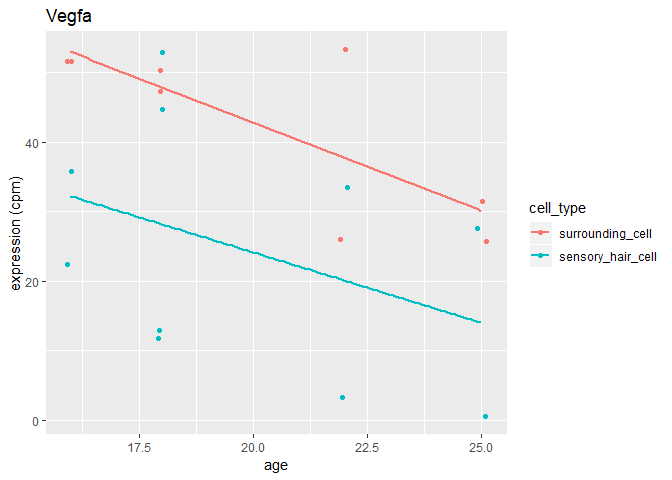
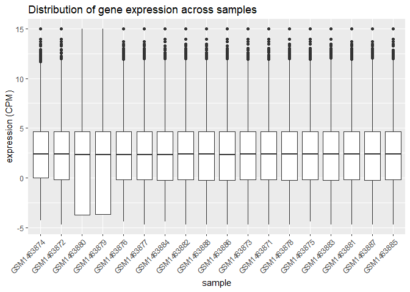
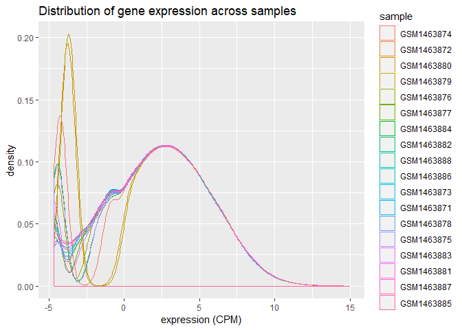
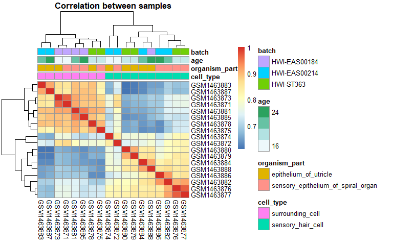
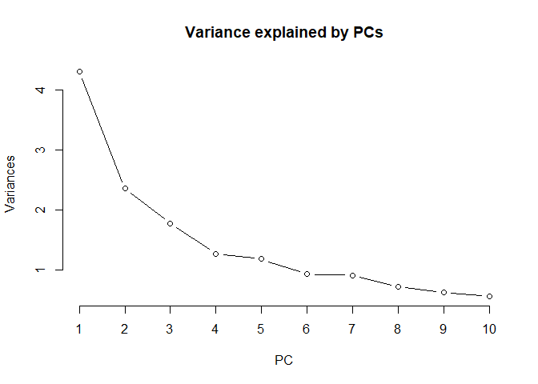
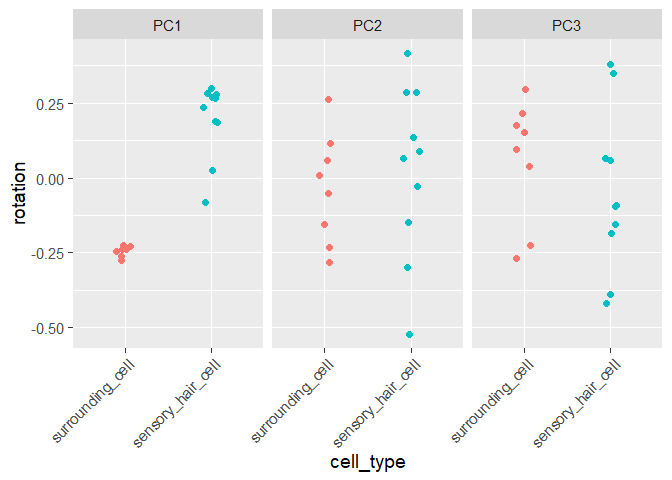
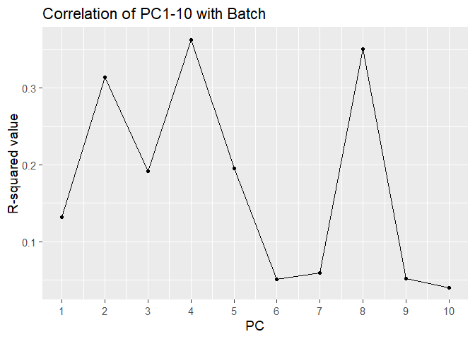

# Brief summary of study goal, design, data

* __Link:__ [https://www.ncbi.nlm.nih.gov/pubmed/25904789](https://www.ncbi.nlm.nih.gov/pubmed/25904789)
* __Goal:__ To identify genes highly expressed in inner ear hair cells (HCs) _vs._ surrounding cells (SCs) during development.
* __Design factors:__
    - 16 samples with a matrix design of 3 factors
        - cell types: HCs, SCs
        - tissue sources: cochlea, utricle
        - developmental stage: E16, P0, P4, P7
* __Gene expression analysis method in brief:__
    - mRNA amplification (NuGEN  Ovation 3′-DGE System)
    - Illumina RNA-seq

    
## Data pre-processing summary

* The raw reads have been mapped and processed into gene expression values using an established RNA-Seq pipeline at the Pavlidis Lab during data curation in Gemma. 
* Expression values are given in Counts per Million (CPM).
* Quantile normalization has been done as part of the data processing pipeline.


# Question 1: Data Inspection and Basic Manipulation
## Q1.1 Importing the data and getting familiar with it

### Read the datasets into RStudio
* Design matrix:   

```r
design <- readRDS("./data/gse60019_experiment_design.RDS")

kable(design)
```


sample       organism_part                        cell_type           time_point   batch        
-----------  -----------------------------------  ------------------  -----------  -------------
GSM1463874   epithelium_of_utricle                sensory_hair_cell   E16          HWI-EAS00214 
GSM1463872   sensory_epithelium_of_spiral_organ   sensory_hair_cell   E16          HWI-EAS00214 
GSM1463880   epithelium_of_utricle                sensory_hair_cell   P0           HWI-ST363    
GSM1463879   epithelium_of_utricle                sensory_hair_cell   P0           HWI-ST363    
GSM1463876   sensory_epithelium_of_spiral_organ   sensory_hair_cell   P0           HWI-ST363    
GSM1463877   sensory_epithelium_of_spiral_organ   sensory_hair_cell   P0           HWI-ST363    
GSM1463884   epithelium_of_utricle                sensory_hair_cell   P4           HWI-EAS00214 
GSM1463882   sensory_epithelium_of_spiral_organ   sensory_hair_cell   P4           HWI-EAS00214 
GSM1463888   epithelium_of_utricle                sensory_hair_cell   P7           HWI-EAS00184 
GSM1463886   sensory_epithelium_of_spiral_organ   sensory_hair_cell   P7           HWI-EAS00214 
GSM1463873   epithelium_of_utricle                surrounding_cell    E16          HWI-EAS00184 
GSM1463871   sensory_epithelium_of_spiral_organ   surrounding_cell    E16          HWI-EAS00184 
GSM1463878   epithelium_of_utricle                surrounding_cell    P0           HWI-ST363    
GSM1463875   sensory_epithelium_of_spiral_organ   surrounding_cell    P0           HWI-ST363    
GSM1463883   epithelium_of_utricle                surrounding_cell    P4           HWI-EAS00214 
GSM1463881   sensory_epithelium_of_spiral_organ   surrounding_cell    P4           HWI-EAS00184 
GSM1463887   epithelium_of_utricle                surrounding_cell    P7           HWI-EAS00214 
GSM1463885   sensory_epithelium_of_spiral_organ   surrounding_cell    P7           HWI-EAS00184 

```r
dim(design)
```

```
## [1] 18  5
```

* Expresion matrix:

```r
expr <- readRDS("./data/gse60019_expression_matrix.RDS")

kable(head(expr))
```


gene              GSM1463874   GSM1463872   GSM1463880   GSM1463879   GSM1463876   GSM1463877   GSM1463884   GSM1463882   GSM1463888   GSM1463886   GSM1463873   GSM1463871   GSM1463878   GSM1463875   GSM1463883   GSM1463881   GSM1463887   GSM1463885
--------------  ------------  -----------  -----------  -----------  -----------  -----------  -----------  -----------  -----------  -----------  -----------  -----------  -----------  -----------  -----------  -----------  -----------  -----------
0610005C13Rik      0.0522182    0.5275931     1.453567     3.464257    0.8001461     1.477496    0.7740577    0.6565098    0.8027127    0.7118245    0.7135403    0.1735911    0.9137405    0.0463842    0.4107564     1.162428    0.2972406    0.5236888
0610009B22Rik     14.1159130   13.6861318    32.997022    30.627791   37.1779679    31.407523   23.1645671   24.3215389   22.3662102   38.3671878   13.5855645   13.6562649   17.7271954   12.0930888    7.9380154     9.598021   24.7824351   10.1526455
0610009E02Rik    107.1644989   16.2449504     3.795384     4.681342   17.8690200    15.204918    4.5387189   16.9787818    6.6599332    3.9542801   25.4896491   29.3781209   37.6044764   65.9324915   39.3761719    26.941200   18.4905642   19.8659297
0610009L18Rik      0.4970015    0.4388886     4.110369     3.177531    2.9508601     1.615105    6.7801803    2.8809044    4.3221540    3.8368561    0.9101905    0.4911543    0.7167850    0.0463842    1.3303767     0.553437    0.7436384    1.9732374
0610009O20Rik      1.8743391    1.4859379     3.433995     6.644128    2.7576718     2.615899    3.7865002    2.5035036    2.4986302    2.9316073    1.5464678    1.5730983    4.5882048    2.7281258    2.6371200     1.881533    1.0399952    1.3078191
0610010B08Rik     29.3175625   52.9631556     7.750423    31.971378   61.9967805    45.421389   19.1016988   27.0685443   48.4207283   17.4639627   25.2255571   33.6331055   32.5700766   33.3966396   43.1861261    33.154753   29.3608552   24.6736824

```r
dim(expr)
```

```
## [1] 14479    19
```

### How many genes are there?

```r
ngene <- nrow(expr)
```

> There are 14479 genes in the expression matrix.

### How many samples are there?

```r
nsamp <- nrow(design)
```

> There are 18 samples in the experiment design.

### How many factors are in our experimental design? How may levels per factor? List out the levels for each factor.

```r
str(design)
```

```
## Classes 'tbl_df', 'tbl' and 'data.frame':	18 obs. of  5 variables:
##  $ sample       : chr  "GSM1463874" "GSM1463872" "GSM1463880" "GSM1463879" ...
##  $ organism_part: Factor w/ 2 levels "epithelium_of_utricle",..: 1 2 1 1 2 2 1 2 1 2 ...
##  $ cell_type    : Factor w/ 2 levels "surrounding_cell",..: 2 2 2 2 2 2 2 2 2 2 ...
##  $ time_point   : Factor w/ 4 levels "E16","P0","P4",..: 1 1 2 2 2 2 3 3 4 4 ...
##  $ batch        : Factor w/ 3 levels "HWI-EAS00184",..: 2 2 3 3 3 3 2 2 1 2 ...
```

```r
op <- levels(design$organism_part)
ct <- levels(design$cell_type)
tp <- levels(design$time_point)
bt <- levels(design$batch)
```

> There are 4 factors in the experimental design (organism_part, cell_type, time_point, batch).

> Number of levels per factor:

  - organism_part: 2  
  - cell_type: 2  
  - time_point: 4  
  - batch: 3  
  
> Level names:  

  - organism_part: epithelium_of_utricle, sensory_epithelium_of_spiral_organ  
  - cell_type: surrounding_cell, sensory_hair_cell  
  - time_point: E16, P0, P4, P7  
  - batch: HWI-EAS00184, HWI-EAS00214, HWI-ST363  
  
## Q1.2 Data manipulation
Here I will create a new design variable, `age`, which will be a numerical representation of the factor `time_point`. This assumes that P0 = 18 days.

```r
design_age <- mutate(design, age = time_point) 
levels(design_age$age) <- c(16, 18, 18+4, 18+7)

design_age$age <- as.numeric(as.character(design_age$age)) ## this is important to avoid loss of numerical information

# check
str(design_age)
```

```
## Classes 'tbl_df', 'tbl' and 'data.frame':	18 obs. of  6 variables:
##  $ sample       : chr  "GSM1463874" "GSM1463872" "GSM1463880" "GSM1463879" ...
##  $ organism_part: Factor w/ 2 levels "epithelium_of_utricle",..: 1 2 1 1 2 2 1 2 1 2 ...
##  $ cell_type    : Factor w/ 2 levels "surrounding_cell",..: 2 2 2 2 2 2 2 2 2 2 ...
##  $ time_point   : Factor w/ 4 levels "E16","P0","P4",..: 1 1 2 2 2 2 3 3 4 4 ...
##  $ batch        : Factor w/ 3 levels "HWI-EAS00184",..: 2 2 3 3 3 3 2 2 1 2 ...
##  $ age          : num  16 16 18 18 18 18 22 22 25 25 ...
```


## Q1.3 Single gene graphing
Here I will graph expression of Vegfa vs. age, with regression lines for the 2 cell types.

```r
# take Vegfa row of expression matrix and melt
vegfa <- filter(expr, gene == "Vegfa") %>%
  column_to_rownames(var = "gene") %>%
  melt()

colnames(vegfa) <- c("sample", "expression")

# join with metadata
vegfa <- left_join(vegfa, design_age, by = "sample")

# graph age vs. expression of gene
ggplot(vegfa, aes(age, expression, colour = cell_type)) +
  geom_jitter(width = 0.1) +
  geom_smooth(method = "glm", se = F) +
  ggtitle("Vegfa") +
  labs(y = "expression (cpm)")
```

<!-- -->

### Is there sign of interaction between cell_type and age for Vegfa?

> There appears to be no interaction between cell type and age for Vegfa, as the lines are parallel between the surrounding cell and sensory hair cell types.


# Question 2: Assessing overall data quality
## Q2.1 Overall distributions
The expression values are currently in CPM. Here I will Log2 transform them so that the distribution is more evenly spread out and can be examined more easily.

```r
logexpr <- column_to_rownames(expr, var = "gene") %>%
  log2() %>%
  rownames_to_column(var = "gene")

logexpr[1:5, 1:5] %>% kable()
```


gene             GSM1463874   GSM1463872   GSM1463880   GSM1463879
--------------  -----------  -----------  -----------  -----------
0610005C13Rik     -4.259304   -0.9225025     0.539598     1.792546
0610009B22Rik      3.819250    3.7746428     5.044264     4.936769
0610009E02Rik      6.743683    4.0219194     1.924246     2.226922
0610009L18Rik     -1.008678   -1.1880733     2.039268     1.667906
0610009O20Rik      0.906382    0.5713738     1.779888     2.732080

I will examine the distribution of gene expression across all samples:  

### Boxplot

```r
# melt the data by sample
logmelt <- melt(logexpr, id.vars = "gene", variable.name = "sample", value.name = "expression")

# boxplot
ggplot(logmelt, aes(sample, expression)) +
  geom_boxplot() +
  theme(axis.text.x = element_text(angle = 45, hjust = 1)) +
  ggtitle("Distribution of gene expression across samples") +
  labs(y = "expression (CPM)")
```

<!-- -->

### Overlapping density plots

```r
ggplot(logmelt, aes(x = expression, colour = sample)) +
  geom_density() +
  ggtitle("Distribution of gene expression across samples") +
  labs(x = "expression (CPM)")
```

<!-- -->

### Which two samples stand out as different, in terms of the distribution of expression values, compared to the rest?

> Observation: Samples GSM1463879 and GSM1463880 have more genes with low expression values compared to the other samples.


## Q2.2 How do the samples correlate with one another?
I will examine the correlations between samples using a heatmap.

```r
library(pheatmap)

# correlation matrix comparing samples
correlation <- column_to_rownames(logexpr, var = "gene") %>%
  cor(method = "pearson")

# prep the annotation df: consider cell_type, organism_part, age, and batch
anno <- column_to_rownames(design_age, var = "sample") %>%
  select(cell_type, organism_part, age, batch) %>%
  as.data.frame()

pheatmap(mat = correlation, 
         cluster_rows = T, 
         cluster_cols = T, 
         annotation = anno,
         main = "Correlation between samples"
         )
```

<!-- -->


### Among the factors cell_type, organism_part, age, and batch, which one seems to be most strongly correlated with clusters in gene expression data?

> The cell type is most strongly correlated with the clusters in gene expression data.

### There is a sample whose expression values correlate with the samples of the different cell_type just as well as with the samples of the same cell_type. Identify this sample by its ID.

> The sample GSM1463872 is a sensory hair cell sample, but its expression profile also correlates with the surrounding cells.


# Question 3: Using PCA to dig deeper
## Q3.1 Perform PCA to summarize the samples.
I will perform PCA on scaled and centered data for all genes.
First, I will scale and center the data:

```r
sprDat <- column_to_rownames(expr, var = "gene")
sprDat <- t(scale(t(sprDat)))

round(data.frame(avgBefore = rowMeans(head(expr[,2:ncol(expr)])), avgAfter = rowMeans(head(sprDat)), 
    varBefore = apply(head(expr[,2:ncol(expr)]), 1, var), varAfter = apply(head(sprDat), 1, var)), 
    2) %>% head() %>% kable()
```

                 avgBefore   avgAfter   varBefore   varAfter
--------------  ----------  ---------  ----------  ---------
0610005C13Rik         0.83          0        0.60          1
0610009B22Rik        20.99          0       97.55          1
0610009E02Rik        25.57          0      660.38          1
0610009L18Rik         2.08          0        3.35          1
0610009O20Rik         2.66          0        1.83          1
0610010B08Rik        33.15          0      176.50          1

Second, I will perform PCA analysis:

```r
pcs <- prcomp(x = sprDat, scale. = F, center = F)
```

Here I will plot the variance explained by each PC:

```r
plot(pcs, main = "Variance explained by PCs", type = "l")
title(xlab = "PC")
```

<!-- -->


##Q3.2 Confirm your suspicion. Is cell_type the biggest contributor to variation?
I will plot cell type on the x-axis and PC1, 2, or 3 on the y-axis, and make a visual assessment as to which PC is associated with cell type.

```r
rotn <- pcs$rotation %>% as.data.frame() %>% rownames_to_column(var = "sample")
pcres <- left_join(design_age, rotn, by = "sample")

pc1_3 <- select(pcres, sample, cell_type, PC1:PC3) %>%
  melt(id.vars = c("sample", "cell_type"), variable.name = "PC", value.name = "rotation")

ggplot(pc1_3, aes(cell_type, rotation, colour = cell_type)) +
  geom_jitter(size = 2, width = 0.1) +
  facet_wrap(~PC) +
  theme_gray(base_size = 14) +
  theme(axis.text.x = element_text(angle = 45, hjust = 1),
        legend.position = "none")
```

<!-- -->

> By visual assessment, it appears that PC1 is associated with cell_type. Therefore, cell_type is the biggest contributor to variation.

## Q3.3 Characterizing batch effects.
I will quantitatively assess the association of the batch variable with each PC up to PC10.

* __Definition__: The R-squared value (from a linear model) is interpreted as the proportion of the variance in the dependent variable that is predictable from the independent variable.

```r
# select PC's 1 to 10
pc1_10 <- select(pcres, sample, batch, PC1:PC10) %>%
  gather(key = "PC", value = "rotation", PC1:PC10)

# make a numeric column for the PC number
pc1_10 <- mutate(pc1_10, PC_number = substr(pc1_10$PC, start = 3, stop = 4))

# make empty list to store results
rsquares <- list()

# loop to assess R-squared values
for(i in 1:10){
  subset <- filter(pc1_10, PC_number == i)
  model <- lm(formula = rotation ~ batch, data = subset) %>% summary()
  rsquares[i] <- model$r.squared
}


rsquares_df <- data.frame(PC = seq(1,10,1), r.squared = as.numeric(rsquares))

ggplot(rsquares_df, aes(PC, r.squared)) +
  geom_point() +
  geom_path() +
  scale_x_continuous(breaks = seq(1,10,1)) +
  theme_gray(base_size = 14) +
  ggtitle("Correlation of PC1-10 with Batch") +
  labs(y = "R-squared value")
```

<!-- -->

#### How much of the variation in PC2 is explained by batch effects? How does that compare with PC1?

* 31.4% of the variation in PC2 is explained by batch effects.

* 13.2% of the variation in PC1 is explained by batch effects.

> Therefore, a greater proportion of the variation in PC2 is explained by batch effects compared to PC1.


