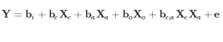

```{r setup, include=FALSE}
knitr::opts_chunk$set(echo = TRUE)
library(tidyverse)
library(knitr)
library(reshape2)
library(limma)
```

# Dataset
* Design matrix:   
```{r}
getwd()
design <- readRDS("../assignment_1/data/gse60019_experiment_design.RDS")
```

* Expresion matrix:
```{r}
expr <- readRDS("../assignment_1/data/gse60019_expression_matrix.RDS")
```


# Question 4: Conducting differential expression analysis
## 4.1: Remove lowly expressed genes

I will retain genes that have CPM > 1 in at least as many samples as the smallest group size:

* Step 1: Determine smallest group size.
```{r}
table(design$time_point)

smallest <- min(table(design$time_point)) %>% unlist()
```

> Therefore, the smallest group size is `r smallest`.

* Step 2: Retain genes that have CPM > 1 in at least `r smallest` samples.
```{r warning = FALSE}
threshold <- column_to_rownames(expr, var = "gene")
threshold <- threshold > 1
keep <- rowSums(threshold) >= 4

head(keep)

expr.hi <- expr[keep,]

head(expr.hi)

remain <- nrow(expr.hi)
```

> `r remain` genes remain after filtering.


## 4.2: Construct linear model

I will use limma-voom to fit a linear model with cell type, organism part, age and the interaction between age and cell type as covariates:

* Step 1: Make model matrix.
```{r}
design <- mutate(design, age = time_point)
levels(design$age) <- c(16, 18, 18+4, 18+7)
design$age <- as.numeric(as.character(design$age))

str(design)

# format the design matrix for model.matrix() function
limma.design <- as.data.frame(design) %>%
  column_to_rownames(var = "sample") %>%
  select(cell_type, organism_part, age)

str(limma.design)
```

```{r}
# make model matrix for limma
mod.mat <- model.matrix(~ cell_type*age + organism_part, limma.design)
```


* Step 2: Limma voom analysis on filtered gene set (lowly expressed genes removed).
```{r warning=FALSE, message=FALSE}
expr.hi <- column_to_rownames(expr.hi, "gene")

# follow instructions for voom analysis in Limma User guide:
v <- voom(counts = expr.hi, design = mod.mat)
fitvoom <- lmFit(v, design = mod.mat)
fitEB <- eBayes(fitvoom)

res <- topTable(fitEB, number = Inf)

head(res)
```

## 4.3: Interpret model
### 4.3.a: For the gene Eva1a, what is the numeric value of the coeffcient of the age term? What does it mean?

```{r}
eva <- res["Eva1a",]$age
```

> The coefficient of the age term for the gene Eva1a is `r eva`. This means that increasing age is associated with a decrease in Eva1a expression, because the coefficient is negative.

```{r eva1a1_age}
eva.expr <- expr.hi["Eva1a",] %>% 
  t() %>% 
  as.data.frame() %>%
  rownames_to_column(var = "sample") %>%
  left_join(design, by = "sample") %>%
  rename(Eva1a_CPM = V1)

ggplot(eva.expr, aes(age, Eva1a_CPM)) +
  geom_point() +
  geom_smooth(method = "lm", se = F) +
  ggtitle("Expression of Eva1a vs. age in days post-conception") +
  theme_bw()
```


### 4.3.b: Write down an equation describing the linear model you specified in 4.2.

* Let __Y__ represent the dependent variable: expression value of a gene of interest.
* Let __X__ represent the independent variables
* Let __b__ represent the coefficients of the independent variables
* For the independent variables:
    - let subscript __c__ denote the `cell_type` variable
    - let subscript __o__ denote the `organism_part` variable
    - let subscript __a__ denote the `age` variable
    - let subscript __i__ denote the intercept
* Let __e__ represent the random error of all terms combined.





### 4.3.c: When you create a linear model, what is the underlying assumptions you are making about the distribution of the data?

> The residuals of the fitted model are normally distributed.


# Question 5: Evaluating the results
## 5.1: Quantifying the number of genes differentially expressed
### 5.1.a: Determine the number of genes differentially expressed by cell type at an FDR less than 0.05.

* I will use the decideTests function to identify differentially expressed genes by cell type
```{r}
de.celltype <- decideTests(fitEB, p.value = 0.05, method = "global", adjust.method = "fdr")

summary(de.celltype)

de.celltype <- de.celltype %>%
  as.data.frame() %>%
  rownames_to_column(var = "gene") %>%
  filter(cell_typesensory_hair_cell != 0)


number.de <- nrow(de.celltype) 
```

> Therefore, `r number.de` genes are differentially expressed by cell type at FDR < 0.05.


### 5.1.b: Determine the number of genes that we expect to be false discoveries on average.

* I will use the average FDR value (from adjusted p-values, since that is where our cutoff was determined) multiplied by the total number of genes from Section 5.1.a to calculate the expected number of false discoveries.
```{r warning=FALSE, message=FALSE}
# calculate actual FDR-adjusted p-value for genes in question from 5.1.a
fdr.top.byCell <- topTable(fitEB, adjust.method = "fdr", number = Inf) %>%
  rownames_to_column(var = "gene") %>%
  filter(gene %in% de.celltype$gene)

# check that I'm still getting the same number of differentially expressed genes in 5.1.a
number.de == nrow(fdr.top.byCell)

# calculate expected n false discoveries
avg.fdr <- mean(fdr.top.byCell$adj.P.Val)

expected.fd <- ceiling(avg.fdr*number.de) # use ceiling() to round up, because you can't have a fraction of a false discovery
```

> Therefore, we expect `r expected.fd` false discoveries.


### 5.1.c: Which variable is associated with the largest number of differentially expressed genes?

* I will use the decideTests function to quantify the number of genes that increase, decrease or don't change in our model:
```{r}
# increase, decrease, OR don't change
tests <- decideTests(fitEB, p.value = 0.05, method = "global", adjust.method = "fdr")
summary(tests)

```

* Now I will determine the variable associated with the largest number of differentially expressed genes:
```{r}
# identify differentially expressed genes (i.e. tests != 0)
diffExp <- tests!=0

# sum the number of differentially expressed for each column
n_diff <- apply(X = diffExp, MARGIN = 2, FUN = sum) %>% 
  as.data.frame()

colnames(n_diff) <- "n_diff"

n_diff
```

> Therefore, the variable associated with the largest number of differentially expressed genes is `age`.


## 5.2: Effect of age - visualize top differentially expressed genes

* I will create a heatmap of the expression (in logCPM) of the top 50 genes differentially expressed by age, sorted by p-values and samples grouped by time point.
* First filter to top differentially expressed by age:
```{r warning = FALSE}
# identify significantly differentially expressed genes by age using decideTests with fdr adjustment
age.signif <- decideTests(fitEB, p.value = 0.05, method = "global", adjust.method = "fdr") %>%
  as.data.frame() %>%
  rownames_to_column(var = "gene") %>%
  filter(age != 0) %>%
  select(gene, age) %>%
  rename(signif = age)

# use p-values for the age variable from the linear model eBayes fit
# filter to only the significant hits from decideTests result (which used fdr-adjusted p-values)
# sort by p-values (lowest to highest) and pick top 50
age.top <- as.data.frame(fitEB$p.value) %>%
  rownames_to_column(var = "gene") %>%
  select(gene, age) %>%
  rename(p.value = age) %>%
  right_join(age.signif, by = "gene") %>%
  arrange(p.value) %>%
  slice(1:50)

head(age.top)

age.top.names <- age.top$gene %>% unlist()

# logCPM (base 2) for the top genes
log.age.top <- expr[which(expr$gene %in% age.top.names),] %>%
  column_to_rownames(var = "gene") %>%
  log2()

head(as.data.frame(log.age.top))
```

* Next, I will order the genes in the logCPM expresion table, from smallest to largest p-value:
```{r warning=FALSE}
# get order of gene names from smallest to largest p-value
order.genes <- age.top$gene %>% unlist()

# reorder the expression table
log.age.top2 <- log.age.top[order.genes,]
rownames(log.age.top2) <- order.genes

head(as.data.frame(log.age.top2))
```


* Finally, I will order the samples by `time_point` and plot:
```{r heatmap_agediff, fig.height=8, fig.width=8, warning = FALSE}
library(pheatmap)

# time_point annotations of each sample
anno.frame <- arrange(design, time_point) %>%
  select(sample, time_point, cell_type) %>%
  column_to_rownames(var = "sample") %>%
  as.data.frame()

anno.rows <- select(age.top, gene, p.value) %>%
  column_to_rownames(var = "gene")

# order the expression data columns in order of time_point
order.time <- rownames(anno.frame)
log.age.top3 <- select(log.age.top2, order.time)

# draw heatmap
pheatmap(mat = log.age.top3, cluster_rows = F, cluster_cols = F, annotation_col = anno.frame, annotation_row = anno.rows, main = "Top Differentially Expressed Genes by Age (logCPM)")
```


## 5.3: Interpret the interaction term
### 5.3.a: Explain what you are modeling with this interaction term. For a particular gene, what does a signifcant interaction term mean?

* Our linear model for limma analysis contains an interaction term `cell_type*age`.

* The interaction term looks at whether the effect of age on expression of a gene is different between the cell types under study.

* Here I will give an example of a gene with a significant interaction between `cell_type` and `age`:

```{r message=FALSE, warning=FALSE}
# identify significant interaction term genes based on decideTests result (object `tests`)
signif.int <- tests %>% as.data.frame() %>%
  rownames_to_column(var = "gene") %>%
  filter(`cell_typesensory_hair_cell:age` != 0) %>%
  select(gene, `cell_typesensory_hair_cell:age`)

# pick a gene with a large interaction coefficient among the significant interactions
fdr.top <- topTable(fitEB, p.value = 0.05, adjust.method = "fdr", number = Inf) 

int.top <- fdr.top[signif.int$gene,] %>%
  rownames_to_column(var = "gene") %>%
  mutate(int.absVal = abs(cell_typesensory_hair_cell.age)) %>%
  arrange(desc(int.absVal))

int.top.name <- int.top[1,"gene"]
int.top.coeff <- int.top[1, "cell_typesensory_hair_cell.age"] %>% signif(digits = 3)

```


```{r interaction_example, warning=FALSE}
example <- expr[which(expr$gene == int.top.name),] %>%
  column_to_rownames(var = "gene") %>%
  gather(key = "sample", value = "cpm") %>%
  left_join(design, by = "sample")

example$cell_type <- factor(example$cell_type, levels = c("sensory_hair_cell", "surrounding_cell"))

ggplot(example, aes(age, log2(cpm), color = cell_type)) + 
  geom_point() +
  geom_smooth(method = "lm", se = F) +
  #facet_wrap(~ cell_type) +
  theme_bw(base_size = 14) +
  ggtitle(int.top.name) +
  labs(y = "Expression (logCPM)", x = "Age")
```

* The interaction term coefficient = `r int.top.coeff` for gene `r int.top.name`, which means that the change in gene expression with increasing age is different depending on which cell type you consider. 
    - i.e. For `r int.top.name`, the gene expression increases with age in the sensory hair cells, but expression decreases slightly with age in the surrounding cells (see plot above).  

### 5.3.b: For how many probes is the interaction effect significant (FDR less than 0.05)?

* I will use the decideTests result (`tests`) from Section 5.1.c, to answer this question:

```{r}
n.signif.int <- tests %>% as.data.frame() %>%
  filter(`cell_typesensory_hair_cell:age` != 0) %>%
  nrow()
```

> Therefore, there are `r n.signif.int` probes for which the interaction effect is significant.


## 5.4: Plot three genes where the interaction does matter

* I will plot logCPM values of the top three genes with the most significant interaction term. 
* I will filter the decideTests result to the 3 lowest p-values for the interaction term from the linear model eBayes fit result (`fitEB`).

```{r}
# interaction term p values from linear model eBayes fit
int.pvals <- as.data.frame(fitEB$p.value) %>%
  rownames_to_column(var = "gene") %>%
  select(gene, `cell_typesensory_hair_cell:age`) %>%
  rename(p.value = `cell_typesensory_hair_cell:age`)

# find signif interaction terms, filter the p-values to only signif results, sort by p-value
tests.int <- decideTests(fitEB, p.value = 0.05, method = "global", adjust.method = "fdr") %>%
  as.data.frame() %>%
  rownames_to_column(var = "gene") %>%
  filter(`cell_typesensory_hair_cell:age` != 0) %>%
  rename(signif = `cell_typesensory_hair_cell:age`) %>%
  select(gene, signif) %>%
  left_join(int.pvals, by = "gene")%>%
  arrange(p.value)
  

# double check: how many significant interactions?
nrow(tests.int)
```

```{r interaction_top, warning=FALSE, fig.width=10, fig.height=4}
# top 3 gene names with significant interaction (smallest p-value)
top3.int.names <- slice(tests.int, 1:3) %>%
  select(gene) %>% unlist()

# get logCPM expression data for these genes
log.int.top3 <- expr[which(expr$gene %in% top3.int.names),] %>%
  column_to_rownames(var = "gene") %>%
  log2() %>%
  rownames_to_column(var = "gene") %>%
  gather(key = "sample", value = "logCPM", -gene) %>%
  left_join(design, by = "sample")

# calculate the mean of each treatment group
mean.summary <- group_by(log.int.top3, gene, time_point, organism_part, cell_type) %>%
  summarise(mean_logCPM = mean(logCPM)) %>%
  mutate(age = time_point)

levels(mean.summary$age) <- c(16, 18, 18+4, 18+7)
mean.summary$age <- as.numeric(as.character(mean.summary$age))

# plot
ggplot(mean.summary, aes(age, mean_logCPM)) +
  geom_point(size = 3, aes(color = cell_type, shape = organism_part), position = position_dodge(width = 0.5)) +
  geom_smooth(aes(color = cell_type, linetype = organism_part), method = "lm", se = F) +
  facet_wrap(~gene) +
  theme_bw(base_size = 14) +
  labs(y = "Mean expression (logCPM)", x = "Age") +
  ggtitle("Examples of genes with interaction between cell type and age")
```


# Bonus Question
### Compare your results to those obtained by Scheffer et al (2015). Discuss any discrepancies. List at least three explanations for these discrepancies.

    
