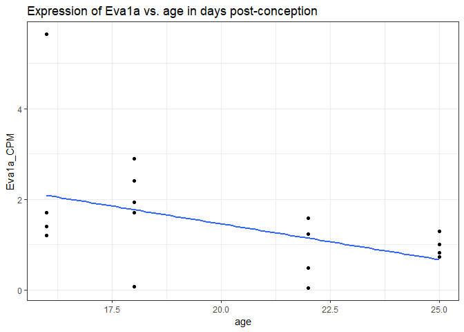
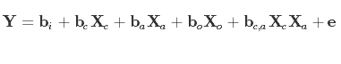
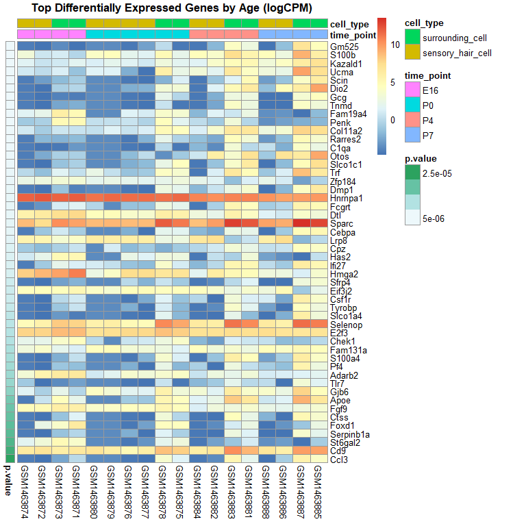
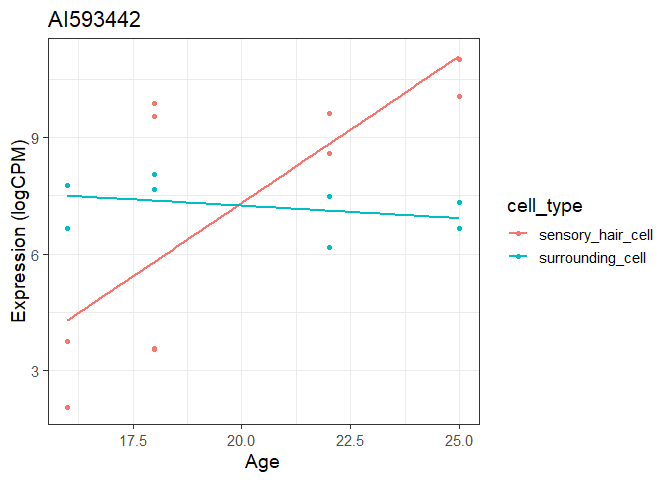
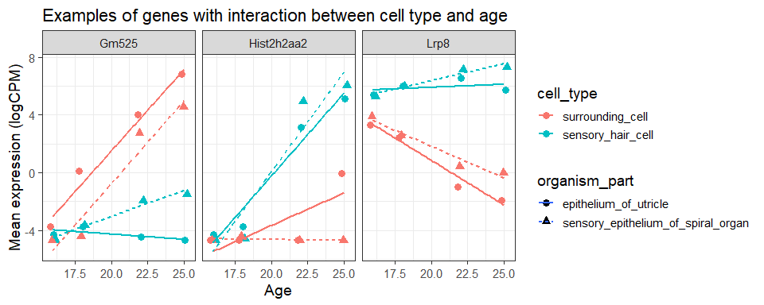

# Dataset
* Design matrix:   

```r
getwd()
```

```
## [1] "C:/Users/Jennifer Grants/Documents/STAT540/zz_Grants-Jennifer_STAT540_2019/assignment_2"
```

```r
design <- readRDS("../assignment_1/data/gse60019_experiment_design.RDS")
```

* Expresion matrix:

```r
expr <- readRDS("../assignment_1/data/gse60019_expression_matrix.RDS")
```


# Question 4: Conducting differential expression analysis
## 4.1: Remove lowly expressed genes

I will retain genes that have CPM > 1 in at least as many samples as the smallest group size:

* Step 1: Determine smallest group size.

```r
table(design$time_point)
```

```
## 
## E16  P0  P4  P7 
##   4   6   4   4
```

```r
smallest <- min(table(design$time_point)) %>% unlist()
```

> Therefore, the smallest group size is 4.

* Step 2: Retain genes that have CPM > 1 in at least 4 samples.

```r
threshold <- column_to_rownames(expr, var = "gene")
threshold <- threshold > 1
keep <- rowSums(threshold) >= 4

head(keep)
```

```
## 0610005C13Rik 0610009B22Rik 0610009E02Rik 0610009L18Rik 0610009O20Rik 
##          TRUE          TRUE          TRUE          TRUE          TRUE 
## 0610010B08Rik 
##          TRUE
```

```r
expr.hi <- expr[keep,]

head(expr.hi)
```

```
## # A tibble: 6 x 19
##   gene  GSM1463874 GSM1463872 GSM1463880 GSM1463879 GSM1463876 GSM1463877
##   <chr>      <dbl>      <dbl>      <dbl>      <dbl>      <dbl>      <dbl>
## 1 0610~     0.0522      0.528       1.45       3.46      0.800       1.48
## 2 0610~    14.1        13.7        33.0       30.6      37.2        31.4 
## 3 0610~   107.         16.2         3.80       4.68     17.9        15.2 
## 4 0610~     0.497       0.439       4.11       3.18      2.95        1.62
## 5 0610~     1.87        1.49        3.43       6.64      2.76        2.62
## 6 0610~    29.3        53.0         7.75      32.0      62.0        45.4 
## # ... with 12 more variables: GSM1463884 <dbl>, GSM1463882 <dbl>,
## #   GSM1463888 <dbl>, GSM1463886 <dbl>, GSM1463873 <dbl>,
## #   GSM1463871 <dbl>, GSM1463878 <dbl>, GSM1463875 <dbl>,
## #   GSM1463883 <dbl>, GSM1463881 <dbl>, GSM1463887 <dbl>, GSM1463885 <dbl>
```

```r
remain <- nrow(expr.hi)
```

> 12761 genes remain after filtering.


## 4.2: Construct linear model

I will use limma-voom to fit a linear model with cell type, organism part, age and the interaction between age and cell type as covariates:

* Step 1: Make model matrix.

```r
design <- mutate(design, age = time_point)
levels(design$age) <- c(16, 18, 18+4, 18+7)
design$age <- as.numeric(as.character(design$age))

str(design)
```

```
## Classes 'tbl_df', 'tbl' and 'data.frame':	18 obs. of  6 variables:
##  $ sample       : chr  "GSM1463874" "GSM1463872" "GSM1463880" "GSM1463879" ...
##  $ organism_part: Factor w/ 2 levels "epithelium_of_utricle",..: 1 2 1 1 2 2 1 2 1 2 ...
##  $ cell_type    : Factor w/ 2 levels "surrounding_cell",..: 2 2 2 2 2 2 2 2 2 2 ...
##  $ time_point   : Factor w/ 4 levels "E16","P0","P4",..: 1 1 2 2 2 2 3 3 4 4 ...
##  $ batch        : Factor w/ 3 levels "HWI-EAS00184",..: 2 2 3 3 3 3 2 2 1 2 ...
##  $ age          : num  16 16 18 18 18 18 22 22 25 25 ...
```

```r
# format the design matrix for model.matrix() function
limma.design <- as.data.frame(design) %>%
  column_to_rownames(var = "sample") %>%
  select(cell_type, organism_part, age)

str(limma.design)
```

```
## 'data.frame':	18 obs. of  3 variables:
##  $ cell_type    : Factor w/ 2 levels "surrounding_cell",..: 2 2 2 2 2 2 2 2 2 2 ...
##  $ organism_part: Factor w/ 2 levels "epithelium_of_utricle",..: 1 2 1 1 2 2 1 2 1 2 ...
##  $ age          : num  16 16 18 18 18 18 22 22 25 25 ...
```


```r
# make model matrix for limma
mod.mat <- model.matrix(~ cell_type*age + organism_part, limma.design)
```


* Step 2: Limma voom analysis on filtered gene set (lowly expressed genes removed).

```r
expr.hi <- column_to_rownames(expr.hi, "gene")

# follow instructions for voom analysis in Limma User guide:
v <- voom(counts = expr.hi, design = mod.mat)
fitvoom <- lmFit(v, design = mod.mat)
fitEB <- eBayes(fitvoom)

res <- topTable(fitEB, number = Inf)

head(res)
```

```
##          cell_typesensory_hair_cell         age
## Srrm4                     8.0853021 -0.06798485
## Mmp2                      0.1513408  0.16039480
## Tmem178b                  4.1747243 -0.04387200
## Mreg                      5.9541515 -0.15340249
## Nhlh1                     9.7191877  0.06163693
## Gdap1                     7.1188294  0.08299975
##          organism_partsensory_epithelium_of_spiral_organ
## Srrm4                                         -0.2518477
## Mmp2                                          -0.1536903
## Tmem178b                                       0.2910592
## Mreg                                           0.5794255
## Nhlh1                                          0.4932251
## Gdap1                                          0.1964680
##          cell_typesensory_hair_cell.age  AveExpr        F      P.Value
## Srrm4                       -0.02253305 5.554990 185.0660 7.874118e-15
## Mmp2                        -0.25292320 4.012810 159.2475 3.107340e-14
## Tmem178b                     0.12121095 4.384313 155.8229 3.788115e-14
## Mreg                         0.03953329 9.071034 149.3805 5.563554e-14
## Nhlh1                       -0.11631737 4.013361 138.0187 1.141452e-13
## Gdap1                       -0.03174913 4.180491 137.8648 1.153062e-13
##             adj.P.Val
## Srrm4    1.004816e-10
## Mmp2     1.611338e-10
## Tmem178b 1.611338e-10
## Mreg     1.774913e-10
## Nhlh1    2.146004e-10
## Gdap1    2.146004e-10
```

## 4.3: Interpret model
### 4.3.a: For the gene Eva1a, what is the numeric value of the coeffcient of the age term? What does it mean?


```r
eva <- res["Eva1a",]$age
```

> The coefficient of the age term for the gene Eva1a is -0.1634874. This means that increasing age is associated with a decrease in Eva1a expression, because the coefficient is negative.


```r
eva.expr <- expr.hi["Eva1a",] %>% 
  t() %>% 
  as.data.frame() %>%
  rownames_to_column(var = "sample") %>%
  left_join(design, by = "sample") %>%
  rename(Eva1a_CPM = V1)

ggplot(eva.expr, aes(age, Eva1a_CPM)) +
  geom_point() +
  geom_smooth(method = "lm", se = F) +
  ggtitle("Expression of Eva1a vs. age in days post-conception") +
  theme_bw()
```

<!-- -->


### 4.3.b: Write down an equation describing the linear model you specified in 4.2.

* Let __Y__ represent the dependent variable: expression value of a gene of interest.
* Let __X__ represent the independent variables
* Let __b__ represent the coefficients of the independent variables
* For the independent variables:
    - let subscript __c__ denote the `cell_type` variable
    - let subscript __o__ denote the `organism_part` variable
    - let subscript __a__ denote the `age` variable
    - let subscript __i__ denote the intercept
* Let __e__ represent the random error of all terms combined.





### 4.3.c: When you create a linear model, what is the underlying assumptions you are making about the distribution of the data?

> The residuals of the fitted model are normally distributed.


# Question 5: Evaluating the results
## 5.1: Quantifying the number of genes differentially expressed
### 5.1.a: Determine the number of genes differentially expressed by cell type at an FDR less than 0.05.

* I will use the decideTests function to identify differentially expressed genes by cell type

```r
de.celltype <- decideTests(fitEB, p.value = 0.05, method = "global", adjust.method = "fdr") %>%
  as.data.frame() %>%
  rownames_to_column(var = "gene") %>%
  filter(cell_typesensory_hair_cell != 0)


number.de <- nrow(de.celltype) 
```

> Therefore, 176 genes are differentially expressed by cell type at FDR < 0.05.


### 5.1.b: Determine the number of genes that we expect to be false discoveries on average.

* I will use the average FDR value (from adjusted p-values, since that is where our cutoff was determined) multiplied by the total number of genes from Section 5.1.a to calculate the expected number of false discoveries.

```r
# calculate actual FDR-adjusted p-value for genes in question from 5.1.a
fdr.top.byCell <- topTable(fitEB, adjust.method = "fdr", number = Inf) %>%
  rownames_to_column(var = "gene") %>%
  filter(gene %in% de.celltype$gene)

# check that I'm still getting the same number of differentially expressed genes in 5.1.a
number.de == nrow(fdr.top.byCell)
```

```
## [1] TRUE
```

```r
# calculate expected n false discoveries
avg.fdr <- mean(fdr.top.byCell$adj.P.Val)

expected.fd <- ceiling(avg.fdr*number.de) # use ceiling() to round up, because you can't have a fraction of a false discovery
```

> Therefore, we expect 1 false discoveries.


### 5.1.c: Which variable is associated with the largest number of differentially expressed genes?

* I will use the decideTests function to quantify the number of genes that increase, decrease or don't change in our model:

```r
# increase, decrease, OR don't change
tests <- decideTests(fitEB, p.value = 0.05, method = "global", adjust.method = "fdr")
summary(tests)
```

```
##        (Intercept) cell_typesensory_hair_cell   age
## Down            62                         83   297
## NotSig        7898                      12585 12090
## Up            4801                         93   374
##        organism_partsensory_epithelium_of_spiral_organ
## Down                                               321
## NotSig                                           12165
## Up                                                 275
##        cell_typesensory_hair_cell:age
## Down                              187
## NotSig                          12377
## Up                                197
```

* Now I will determine the variable associated with the largest number of differentially expressed genes:

```r
# identify differentially expressed genes (i.e. tests != 0)
diffExp <- tests!=0

# sum the number of differentially expressed for each column
n_diff <- apply(X = diffExp, MARGIN = 2, FUN = sum) %>% 
  as.data.frame()

colnames(n_diff) <- "n_diff"

n_diff
```

```
##                                                 n_diff
## (Intercept)                                       4863
## cell_typesensory_hair_cell                         176
## age                                                671
## organism_partsensory_epithelium_of_spiral_organ    596
## cell_typesensory_hair_cell:age                     384
```

> Therefore, the variable associated with the largest number of differentially expressed genes is `age`.


## 5.2: Effect of age - visualize top differentially expressed genes

* I will create a heatmap of the expression (in logCPM) of the top 50 genes differentially expressed by age, sorted by p-values and samples grouped by time point.
* First filter to top differentially expressed by age:

```r
# identify significantly differentially expressed genes by age using decideTests with fdr adjustment
age.signif <- decideTests(fitEB, p.value = 0.05, method = "global", adjust.method = "fdr") %>%
  as.data.frame() %>%
  rownames_to_column(var = "gene") %>%
  filter(age != 0) %>%
  select(gene, age) %>%
  rename(signif = age)

# use p-values for the age variable from the linear model eBayes fit
# filter to only the significant hits from decideTests result (which used fdr-adjusted p-values)
# sort by p-values (lowest to highest) and pick top 50
age.top <- as.data.frame(fitEB$p.value) %>%
  rownames_to_column(var = "gene") %>%
  select(gene, age) %>%
  rename(p.value = age) %>%
  right_join(age.signif, by = "gene") %>%
  arrange(p.value) %>%
  slice(1:50)

head(age.top)
```

```
##      gene      p.value signif
## 1   Gm525 2.015351e-10      1
## 2   S100b 2.708593e-09      1
## 3 Kazald1 5.953135e-09      1
## 4    Ucma 8.954618e-09      1
## 5    Scin 2.983706e-08      1
## 6    Dio2 4.175966e-08      1
```

```r
age.top.names <- age.top$gene %>% unlist()

# logCPM (base 2) for the top genes
log.age.top <- expr[which(expr$gene %in% age.top.names),] %>%
  column_to_rownames(var = "gene") %>%
  log2()

head(as.data.frame(log.age.top))
```

```
##        GSM1463874 GSM1463872 GSM1463880 GSM1463879 GSM1463876 GSM1463877
## Adarb2   3.200803  5.3849956  0.7983539   1.805104   3.646234   3.078377
## Apoe    -4.259304  0.4465933 -3.7588301  -3.693372  -1.009442  -1.064935
## C1qa    -4.259304 -4.6943842 -3.7588301  -3.693372  -4.434054  -4.694384
## Ccl3    -4.259304 -4.6943842 -3.7588301  -3.693372  -4.434054  -4.694384
## Cd9      6.290571  6.8392624  6.8561767   5.944299   4.898785   5.920733
## Cebpa   -4.259304 -1.1880733 -3.7588301  -3.693372  -2.224358  -4.694384
##        GSM1463884 GSM1463882 GSM1463888 GSM1463886 GSM1463873  GSM1463871
## Adarb2  0.4083645   2.657264  1.1062504  1.1465499  6.3213269  6.42299392
## Apoe    1.4672313   2.305782  0.7371543  1.4279436  4.5676946  2.11216671
## C1qa   -1.8178250  -3.717095  0.2276658 -2.1578898 -4.4302238 -3.20132429
## Ccl3   -4.4302238  -3.717095 -4.6943842 -0.8254224 -2.5187711 -0.02985604
## Cd9     5.9589862   6.576203  6.7288604  5.7513417  5.9397930  6.52508984
## Cebpa  -1.8178250  -2.590048 -4.6943842 -0.9431008  0.8407059 -0.83783096
##         GSM1463878 GSM1463875 GSM1463883   GSM1463881 GSM1463887
## Adarb2  3.62268350   3.940102   2.099579 3.0773089549   1.396014
## Apoe    5.24221646   4.380595   8.154554 6.6347200222   8.964707
## C1qa   -0.01397589  -4.430224   3.257466 0.0006151224   3.969500
## Ccl3    3.55861731   1.345213   5.132005 1.9707537584   5.543415
## Cd9     8.50233477   7.936429  10.250382 8.7931443434   9.773900
## Cebpa   1.96691799   1.763557   2.492790 2.0718955710   4.639090
##        GSM1463885
## Adarb2   1.690661
## Apoe     6.667733
## C1qa     2.475496
## Ccl3     3.868891
## Cd9      9.651425
## Cebpa    4.937924
```

* Next, I will order the genes in the logCPM expresion table, from smallest to largest p-value:

```r
# get order of gene names from smallest to largest p-value
order.genes <- age.top$gene %>% unlist()

# reorder the expression table
log.age.top2 <- log.age.top[order.genes,]
rownames(log.age.top2) <- order.genes

head(as.data.frame(log.age.top2))
```

```
##         GSM1463874 GSM1463872 GSM1463880 GSM1463879 GSM1463876 GSM1463877
## Gm525    -4.259304 -4.6943842  -3.758830  -3.693372  -4.434054 -2.8365553
## S100b     3.103317  0.5890045   3.990063   4.471893   1.884661  1.6615951
## Kazald1   1.651628  0.5104956   1.180860   1.920323   1.638248  0.8378981
## Ucma      0.906382  0.1663903   1.428770   1.369505  -2.224358 -4.6943842
## Scin     -4.259304 -3.0443660  -3.758830  -3.693372  -4.434054 -4.6943842
## Dio2     -4.259304 -4.6943842  -3.758830  -3.693372  -2.224358 -2.1026918
##         GSM1463884 GSM1463882 GSM1463888 GSM1463886 GSM1463873 GSM1463871
## Gm525    -4.430224  -1.921947  -4.694384  -1.490742 -3.7568233 -4.6943842
## S100b     4.393776   3.743270   4.488476   2.632029  1.0363072 -0.3196084
## Kazald1   1.551692   3.726389   3.069088   4.090634  0.8031221  1.7782993
## Ucma      2.938337   1.730360   2.925347   2.283552  1.1805079 -1.3058988
## Scin     -4.430224  -1.259231  -3.036497  -1.361668 -1.7568138 -0.8012597
## Dio2     -4.430224   1.379347  -1.455808   4.607820 -0.5839843 -0.2011463
##          GSM1463878 GSM1463875 GSM1463883 GSM1463881 GSM1463887 GSM1463885
## Gm525    0.09259563  -4.430224   4.037943   2.728853   6.822224   4.538017
## S100b    4.77779264   2.035501   7.392149   5.374266   9.011245   5.997418
## Kazald1  2.80511956   1.845517   4.682340   5.021844   6.159255   7.043323
## Ucma     5.79749898   2.228671   6.413029   4.192791   9.637986   7.122509
## Scin    -2.02741803   1.151710   1.365784   4.864300   3.907230   6.171386
## Dio2     3.21149115   3.145504   4.901450   6.371138   6.155147   9.508455
```


* Finally, I will order the samples by `time_point` and plot:

```r
library(pheatmap)

# time_point annotations of each sample
anno.frame <- arrange(design, time_point) %>%
  select(sample, time_point, cell_type) %>%
  column_to_rownames(var = "sample") %>%
  as.data.frame()

anno.rows <- select(age.top, gene, p.value) %>%
  column_to_rownames(var = "gene")

# order the expression data columns in order of time_point
order.time <- rownames(anno.frame)
log.age.top3 <- select(log.age.top2, order.time)

# draw heatmap
pheatmap(mat = log.age.top3, cluster_rows = F, cluster_cols = F, annotation_col = anno.frame, annotation_row = anno.rows, main = "Top Differentially Expressed Genes by Age (logCPM)")
```

<!-- -->


## 5.3: Interpret the interaction term
### 5.3.a: Explain what you are modeling with this interaction term. For a particular gene, what does a signifcant interaction term mean?

* Our linear model for limma analysis contains an interaction term `cell_type*age`.

* The interaction term looks at whether the effect of age on expression of a gene is different between the cell types under study.

* Here I will give an example of a gene with a significant interaction between `cell_type` and `age`:


```r
# identify significant interaction term genes based on decideTests result (object `tests`)
signif.int <- tests %>% as.data.frame() %>%
  rownames_to_column(var = "gene") %>%
  filter(`cell_typesensory_hair_cell:age` != 0) %>%
  select(gene, `cell_typesensory_hair_cell:age`)

# pick a gene with a large interaction coefficient among the significant interactions
fdr.top <- topTable(fitEB, p.value = 0.05, adjust.method = "fdr", number = Inf) 

int.top <- fdr.top[signif.int$gene,] %>%
  rownames_to_column(var = "gene") %>%
  mutate(int.absVal = abs(cell_typesensory_hair_cell.age)) %>%
  arrange(desc(int.absVal))

int.top.name <- int.top[1,"gene"]
int.top.coeff <- int.top[1, "cell_typesensory_hair_cell.age"] %>% signif(digits = 3)
```


```r
example <- expr[which(expr$gene == int.top.name),] %>%
  column_to_rownames(var = "gene") %>%
  gather(key = "sample", value = "cpm") %>%
  left_join(design, by = "sample")

example$cell_type <- factor(example$cell_type, levels = c("sensory_hair_cell", "surrounding_cell"))

ggplot(example, aes(age, log2(cpm), color = cell_type)) + 
  geom_point() +
  geom_smooth(method = "lm", se = F) +
  #facet_wrap(~ cell_type) +
  theme_bw(base_size = 14) +
  ggtitle(int.top.name) +
  labs(y = "Expression (logCPM)", x = "Age")
```

<!-- -->

* The interaction term coefficient = 0.766 for gene AI593442, which means that the change in gene expression with increasing age is different depending on which cell type you consider. 
    - i.e. For AI593442, the gene expression increases with age in the sensory hair cells, but expression decreases slightly with age in the surrounding cells (see plot above).  

### 5.3.b: For how many probes is the interaction effect significant (FDR less than 0.05)?

* I will use the decideTests result (`tests`) from Section 5.1.c, to answer this question:


```r
n.signif.int <- tests %>% as.data.frame() %>%
  filter(`cell_typesensory_hair_cell:age` != 0) %>%
  nrow()
```

> Therefore, there are 384 probes for which the interaction effect is significant.


## 5.4: Plot three genes where the interaction does matter

* I will plot logCPM values of the top three genes with the most significant interaction term. 
* I will filter the decideTests result to the 3 lowest p-values for the interaction term from the linear model eBayes fit result (`fitEB`).


```r
# interaction term p values from linear model eBayes fit
int.pvals <- as.data.frame(fitEB$p.value) %>%
  rownames_to_column(var = "gene") %>%
  select(gene, `cell_typesensory_hair_cell:age`) %>%
  rename(p.value = `cell_typesensory_hair_cell:age`)

# find signif interaction terms, filter the p-values to only signif results, sort by p-value
tests.int <- decideTests(fitEB, p.value = 0.05, method = "global", adjust.method = "fdr") %>%
  as.data.frame() %>%
  rownames_to_column(var = "gene") %>%
  filter(`cell_typesensory_hair_cell:age` != 0) %>%
  rename(signif = `cell_typesensory_hair_cell:age`) %>%
  select(gene, signif) %>%
  left_join(int.pvals, by = "gene")%>%
  arrange(p.value)
  

# double check: how many significant interactions?
nrow(tests.int)
```

```
## [1] 384
```


```r
# top 3 gene names with significant interaction (smallest p-value)
top3.int.names <- slice(tests.int, 1:3) %>%
  select(gene) %>% unlist()

# get logCPM expression data for these genes
log.int.top3 <- expr[which(expr$gene %in% top3.int.names),] %>%
  column_to_rownames(var = "gene") %>%
  log2() %>%
  rownames_to_column(var = "gene") %>%
  gather(key = "sample", value = "logCPM", -gene) %>%
  left_join(design, by = "sample")

# calculate the mean of each treatment group
mean.summary <- group_by(log.int.top3, gene, time_point, organism_part, cell_type) %>%
  summarise(mean_logCPM = mean(logCPM)) %>%
  mutate(age = time_point)

levels(mean.summary$age) <- c(16, 18, 18+4, 18+7)
mean.summary$age <- as.numeric(as.character(mean.summary$age))

# plot
ggplot(mean.summary, aes(age, mean_logCPM)) +
  geom_point(size = 3, aes(color = cell_type, shape = organism_part), position = position_dodge(width = 0.5)) +
  geom_smooth(aes(color = cell_type, linetype = organism_part), method = "lm", se = F) +
  facet_wrap(~gene) +
  theme_bw(base_size = 14) +
  labs(y = "Mean expression (logCPM)", x = "Age") +
  ggtitle("Examples of genes with interaction between cell type and age")
```

<!-- -->


# Bonus Question
### Compare your results to those obtained by Scheffer et al (2015). Discuss any discrepancies. List at least three explanations for these discrepancies.

* Notes: The terminology in the Scheffer et al. 2015 manuscript differs from the terminology used in their datasets. A brief summary of what factors corresponds to which terms in the manuscript:
    - `...hair_cell` = GFP+ cells
    - `surrounding_cell` = GFP- cells
    - utricle terminology is the same in both
    - `...spiral_organ` = cochlea
    
