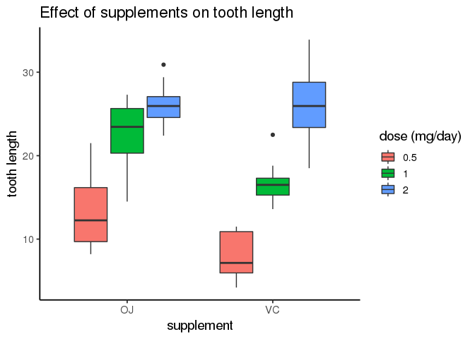

## 2. Data Inspection with R

In this question we will be using the Titanic dataset:


```r
titanic <- data.frame(Titanic)

str(titanic)
```

```
## 'data.frame':	32 obs. of  5 variables:
##  $ Class   : Factor w/ 4 levels "1st","2nd","3rd",..: 1 2 3 4 1 2 3 4 1 2 ...
##  $ Sex     : Factor w/ 2 levels "Male","Female": 1 1 1 1 2 2 2 2 1 1 ...
##  $ Age     : Factor w/ 2 levels "Child","Adult": 1 1 1 1 1 1 1 1 2 2 ...
##  $ Survived: Factor w/ 2 levels "No","Yes": 1 1 1 1 1 1 1 1 1 1 ...
##  $ Freq    : num  0 0 35 0 0 0 17 0 118 154 ...
```


### 2.1 Passenger breakdown

#### 2.1.1 Children

First we want to determine how many children were on Titanic.


```r
child <- sum(titanic[which(titanic$Age == "Child"),]$Freq)
```

> Conclusion: 109 children were on Titanic.


#### 2.1.2 Adults

Next we want to determine how many adults were on Titanic.


```r
adult <- sum(titanic[which(titanic$Age == "Adult"),]$Freq)
```

> Conclusion: 2092 adults were on Titanic.


#### 2.1.3 Adult gender

Finally we want to determine if there were more female adult or male adult passengers.


```r
female <- sum(titanic[which(titanic$Age == "Adult" & titanic$Sex == "Female"),]$Freq)

male <- sum(titanic[which(titanic$Age == "Adult" & titanic$Sex == "Male"),]$Freq)
```

> Conclusions: 

> * There were 425 adult females and 1667 adult males on Titanic.
* Therefore, there were more adult male than adult female passengers.


### 2.2 Survival

#### 2.2.1 Children vs. adults

First we want to determine if children had a better survival rate than adults.

We will calculate the survival rate for each group as Survival_rate = Survived/Total.


```r
ch_surv <- sum(titanic[which(titanic$Age == "Child" & titanic$Survived == "Yes"),]$Freq) / sum(titanic[which(titanic$Age == "Child"),]$Freq)

ad_surv <- sum(titanic[which(titanic$Age == "Adult" & titanic$Survived == "Yes"),]$Freq) / sum(titanic[which(titanic$Age == "Adult"),]$Freq)

ch_greater <- ch_surv>ad_surv
```

> Conclusions:  

> * Child survival rate: 0.5229358  
* Adult survival rate: 0.3126195  
* Child survival > Adult survival? : TRUE  
* Therefore, children had a better survival rate than adults on Titanic.  


#### 2.2.2 By class

Now we want to know which class of passengers have the best survival rate.


```r
summary <- group_by(titanic, Class, Survived) %>%
  summarise(Total = sum(Freq)) %>%
  spread(key = Survived, value = Total) %>%
  rename(Died = No, Survived = Yes) %>%
  mutate(Survival_rate = Survived / (Survived + Died)) %>%
  arrange()
```


Summary of survival rate by class:


```r
print(summary)
```

```
## # A tibble: 4 x 4
## # Groups:   Class [4]
##   Class  Died Survived Survival_rate
##   <fct> <dbl>    <dbl>         <dbl>
## 1 1st     122      203         0.625
## 2 2nd     167      118         0.414
## 3 3rd     528      178         0.252
## 4 Crew    673      212         0.240
```


```r
best_surv <- range(summary$Survival_rate)[2]

name_best <- summary[which(summary$Survival_rate == best_surv),]$Class
```

> Conclusion: The class of passengers with the best survival rate was the 1st class.


## 3. Data visualization

First read in the data and look at the content.


```r
dat <- read.table(file = "./data/guinea_pigs_tooth_growth.txt", sep = "\t", header = TRUE)
```


```r
str(dat)
```

```
## 'data.frame':	60 obs. of  3 variables:
##  $ len : num  4.2 11.5 7.3 5.8 6.4 10 11.2 11.2 5.2 7 ...
##  $ supp: Factor w/ 2 levels "OJ","VC": 2 2 2 2 2 2 2 2 2 2 ...
##  $ dose: num  0.5 0.5 0.5 0.5 0.5 0.5 0.5 0.5 0.5 0.5 ...
```


Next we will graph the effect of the supplements at varying doses upon tooth length. Is there a difference in tooth length depending on the supplement type and dose?


```r
# To separate the graph by dose, first make dose a factor
dat$dose <- as.factor(dat$dose)

ggplot(dat, aes(supp, len)) +
  geom_boxplot(aes(fill = dose)) +
  theme_classic(base_size = 14) +
  labs(x = "supplement", y = "tooth length", fill = "dose (mg/day)") +
  ggtitle("Effect of supplements on tooth length")
```

<!-- -->

> Conclusions:

> * This graph shows that increasing doses of OJ or VC can increase tooth length in guinea pigs.   
* Comparing between supplements, at lower doses (0.5 and 1.0 mg/day), OJ has has a slightly greater effect than VC. At high dose (2 mg/day), the effect of OJ and VC on tooth length is equivalent.  
* I chose to present the data in this way so that I could test the effect of the independent variables (supplement, dose) on the dependent variable (tooth length). It was important to split up the data by dose, otherwise the effect would be masked.  
