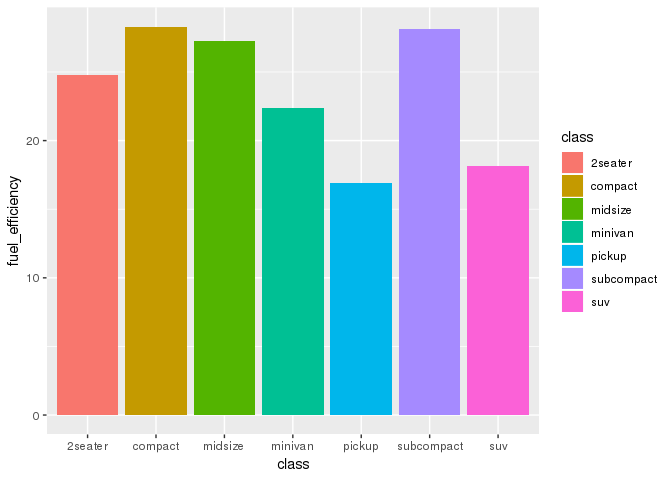
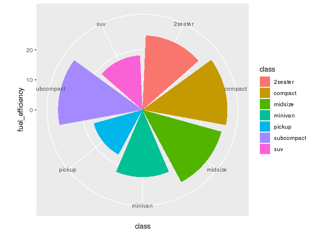
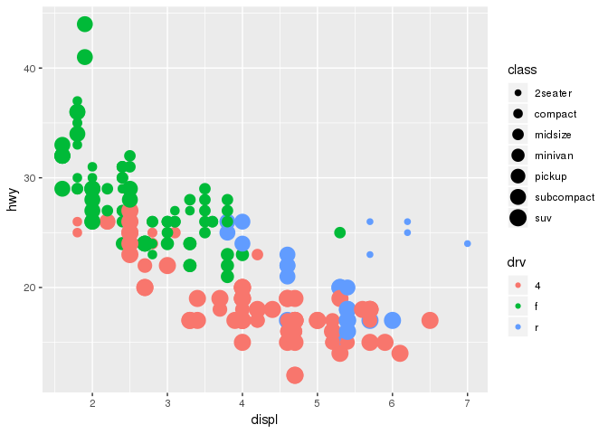

## 1. Inspect mpg data frame 

```r
str(mpg)
```

```
## Classes 'tbl_df', 'tbl' and 'data.frame':	234 obs. of  11 variables:
##  $ manufacturer: chr  "audi" "audi" "audi" "audi" ...
##  $ model       : chr  "a4" "a4" "a4" "a4" ...
##  $ displ       : num  1.8 1.8 2 2 2.8 2.8 3.1 1.8 1.8 2 ...
##  $ year        : int  1999 1999 2008 2008 1999 1999 2008 1999 1999 2008 ...
##  $ cyl         : int  4 4 4 4 6 6 6 4 4 4 ...
##  $ trans       : chr  "auto(l5)" "manual(m5)" "manual(m6)" "auto(av)" ...
##  $ drv         : chr  "f" "f" "f" "f" ...
##  $ cty         : int  18 21 20 21 16 18 18 18 16 20 ...
##  $ hwy         : int  29 29 31 30 26 26 27 26 25 28 ...
##  $ fl          : chr  "p" "p" "p" "p" ...
##  $ class       : chr  "compact" "compact" "compact" "compact" ...
```

## 2. Summarise average efficiency by vehicle class 

```r
avgEff <- mpg %>% 
  group_by(class) %>%
  summarise(fuel_efficiency = mean(hwy))

head(avgEff)
```

```
## # A tibble: 6 x 2
##   class      fuel_efficiency
##   <chr>                <dbl>
## 1 2seater               24.8
## 2 compact               28.3
## 3 midsize               27.3
## 4 minivan               22.4
## 5 pickup                16.9
## 6 subcompact            28.1
```


## 3. Experiment with coord_polar 

```r
(p <- ggplot(avgEff) +
  geom_bar(aes(class, fuel_efficiency, fill = class), stat = "identity"))
```

<!-- -->

```r
p + coord_polar()
```

<!-- -->


## 4. Deliverable 

```r
ggplot(mpg) +
  geom_point(aes(x = displ, y = hwy, colour = drv, size = class))
```

<!-- -->


