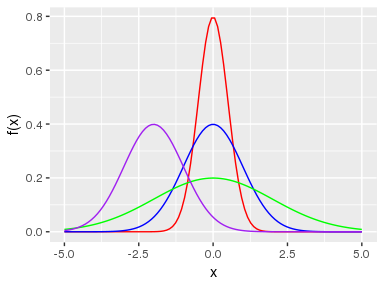
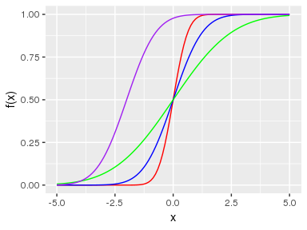
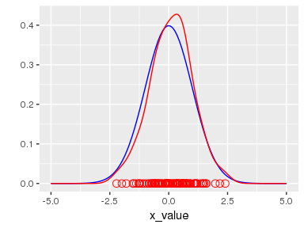
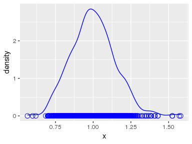
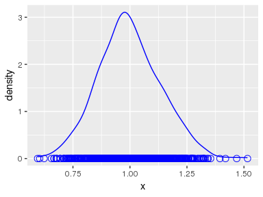
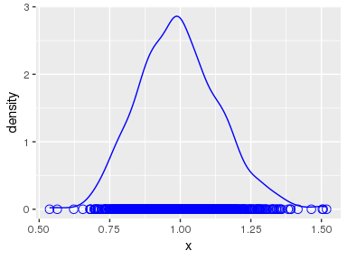
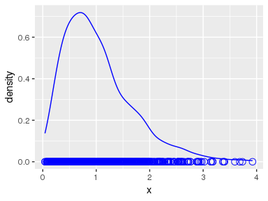
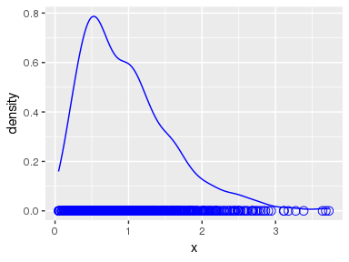
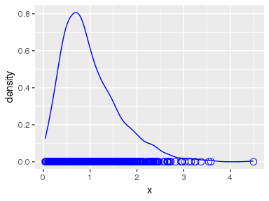

# 1. Demonstration of concepts 

## 1.a. Probability density functions 

* Probability density functions map the values of x (measured variable) to associated probability described by the distribution. 

    * e.g. Function dnorm() 


```r
xValues <- seq(from = -5, to = 5, length = 100)
plotA <- dnorm(xValues, mean = 0, sd = 0.5) #
plotB <-  dnorm(xValues, mean = 0, sd = 1)
plotC <-  dnorm(xValues, mean = 0, sd = 2)
plotD <-  dnorm(xValues, mean = -2, sd = 1)

normalDistributionsTibble <- tibble(x_value = xValues, 
                                    red_value = plotA,
                                    blue_value = plotB,
                                    green_value = plotC,
                                    purple_value = plotD)

p <- normalDistributionsTibble %>% ggplot()
p + 
  geom_line(aes(x = xValues, y = red_value), color = "red") +
  geom_line(aes(x = xValues, y = blue_value), color = "blue") +
  geom_line(aes(x = xValues, y = green_value), color = "green") +
  geom_line(aes(x = xValues, y = purple_value), color = "purple") +
  xlab("x") +
  ylab("f(x)")
```

<!-- -->


## 1.b. Cumulative Distribution Function (CDF) 

* CDF describes the cumulative probability of all values smaller than x. This is why it starts at 0 and goes up to 1, as the probability of all values smaller than x grows with x. The slope corresponds to the spread.

    * e.g. Function: pnorm() 


```r
xValues <- seq(from = -5, to = 5, length = 100)
plotA <- pnorm(xValues, mean = 0, sd = 0.5)
plotB <-  pnorm(xValues, mean = 0, sd = 1)
plotC <-  pnorm(xValues, mean = 0, sd = 2)
plotD <-  pnorm(xValues, mean = -2, sd = 1)

normalDistributionsTibble <- tibble(x_value = xValues, 
                                    red_value = plotA,
                                    blue_value = plotB,
                                    green_value = plotC,
                                    purple_value = plotD)

p <- normalDistributionsTibble %>% ggplot()
p + 
  geom_line(aes(x = xValues, y = red_value), color = "red") +
  geom_line(aes(x = xValues, y = blue_value), color = "blue") +
  geom_line(aes(x = xValues, y = green_value), color = "green") +
  geom_line(aes(x = xValues, y = purple_value), color = "purple") +
  xlab("x") +
  ylab("f(x)")
```

<!-- -->


## 1.c. Simulations 

* In R, we can sample values from the normal distribution easy using the rnorm() function (for example). 


```r
meanValue <- 0
standardDeviation <- 1
numVals <- 100

xValues <- seq(from = -5, to = 5, length = numVals)
trueDistribution <- dnorm(xValues, mean = meanValue, sd = standardDeviation)

dataFrame <- tibble(x_value = xValues, true_value = trueDistribution)

set.seed(1)
randomVals <- rnorm(numVals, mean = meanValue, sd = standardDeviation)

dataFrame %>% ggplot() +
    geom_line(aes(x = x_value, y = true_value), color = "blue") +
    geom_line(aes(x = randomVals), color = "red", stat = "density") +
    geom_point(aes(x = randomVals, y = 0), color = "red", shape = 1, size = 3) +
    ylab("")
```

<!-- -->

## 1.d. Central Limit Theorem 

* The distribution of the sum or means of random samples generated independently (IID) by any distribution will converge to the normal distribution. 

* Example: Generate 1000 samples consisting of 100 random values. Calculate the sample means for each of the 1000 samples generated. Then plot the distribution of the 1000 mean values.

    * Here I will replicate this simulation to see how it changes with different seed values.

#### Replicate 1: 

```r
set.seed(1)

sampleSize <- 100
numSamples <- 1000

degreeFreedom <- 1

randomChiSqValues <- rchisq(n = numSamples * sampleSize, df = degreeFreedom)

samples <- matrix(randomChiSqValues, nrow = numSamples, ncol = sampleSize)
sampleMeans <- rowMeans(samples)

tibble(x = sampleMeans) %>% 
  ggplot() + 
  geom_line(aes(x = x), stat = "density", color = "blue") +
  geom_point(aes(x = x, y = 0), color = "blue", shape = 1, size = 3)
```

<!-- -->

#### Replicate 2: 

```r
set.seed(20)

randomChiSqValues <- rchisq(n = numSamples * sampleSize, df = degreeFreedom)

samples <- matrix(randomChiSqValues, nrow = numSamples, ncol = sampleSize)
sampleMeans <- rowMeans(samples)

tibble(x = sampleMeans) %>% 
  ggplot() + 
  geom_line(aes(x = x), stat = "density", color = "blue") +
  geom_point(aes(x = x, y = 0), color = "blue", shape = 1, size = 3)
```

<!-- -->

#### Replicate 3: 

```r
set.seed(99)

randomChiSqValues <- rchisq(n = numSamples * sampleSize, df = degreeFreedom)

samples <- matrix(randomChiSqValues, nrow = numSamples, ncol = sampleSize)
sampleMeans <- rowMeans(samples)

tibble(x = sampleMeans) %>% 
  ggplot() + 
  geom_line(aes(x = x), stat = "density", color = "blue") +
  geom_point(aes(x = x, y = 0), color = "blue", shape = 1, size = 3)
```

<!-- -->

> Conclusion: This simluation produces a normal distribution with mean = 1 (approximately).


# 2. Deliverable 

* Goal: To determine how well  the CLT holds for smaller sample sizes. 

    * Here I will perform the same simulation as in part 1.d. above, but with sample sizes of n = 5 instead of n = 100 (still 1000 replicates). 

    * I will perform the simulation multiple times with different seed values to see how it changes. 

#### Replicate 1: 

```r
set.seed(1)

sampleSize <- 5
numSamples <- 1000

degreeFreedom <- 1

randomChiSqValues <- rchisq(n = numSamples * sampleSize, df = degreeFreedom)

samples <- matrix(randomChiSqValues, nrow = numSamples, ncol = sampleSize)
sampleMeans <- rowMeans(samples)

tibble(x = sampleMeans) %>% 
  ggplot() + 
  geom_line(aes(x = x), stat = "density", color = "blue") +
  geom_point(aes(x = x, y = 0), color = "blue", shape = 1, size = 3)
```

<!-- -->

#### Replicate 2: 

```r
set.seed(20)

randomChiSqValues <- rchisq(n = numSamples * sampleSize, df = degreeFreedom)

samples <- matrix(randomChiSqValues, nrow = numSamples, ncol = sampleSize)
sampleMeans <- rowMeans(samples)

tibble(x = sampleMeans) %>% 
  ggplot() + 
  geom_line(aes(x = x), stat = "density", color = "blue") +
  geom_point(aes(x = x, y = 0), color = "blue", shape = 1, size = 3)
```

<!-- -->

#### Replicate 3: 

```r
set.seed(99)

randomChiSqValues <- rchisq(n = numSamples * sampleSize, df = degreeFreedom)

samples <- matrix(randomChiSqValues, nrow = numSamples, ncol = sampleSize)
sampleMeans <- rowMeans(samples)

tibble(x = sampleMeans) %>% 
  ggplot() + 
  geom_line(aes(x = x), stat = "density", color = "blue") +
  geom_point(aes(x = x, y = 0), color = "blue", shape = 1, size = 3)
```

<!-- -->

> Conclusion: Applying the CLT to small sample sizes (e.g. n = 5) is not as accurate as when using larger sample sizes (e.g. n = 100). When n = 100, simulation produced a normal distribution with mean = 1. When n = 5, the distribution was skewed right and was more variable between replicates of the simulation compared to when n = 100.

