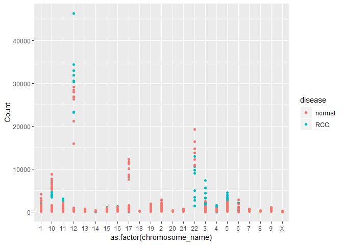
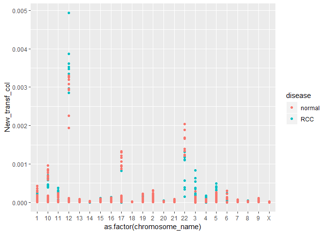
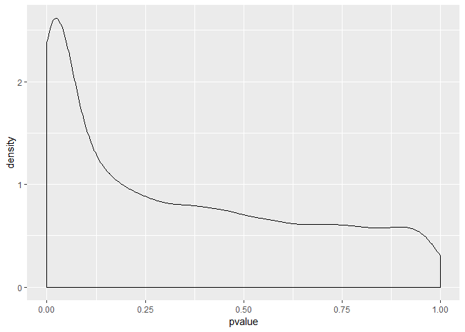

# Part 1 & 2
## Renal Cell Carcinoma vs. Adjacent Normal dataset  

```r
gds <- getGEO("GDS507")
str(gds)
```

```
## Formal class 'GDS' [package "GEOquery"] with 3 slots
##   ..@ gpl      :Formal class 'GPL' [package "GEOquery"] with 2 slots
##   .. .. ..@ dataTable:Formal class 'GEODataTable' [package "GEOquery"] with 2 slots
##   .. .. .. .. ..@ columns:'data.frame':	0 obs. of  0 variables
##   .. .. .. .. ..@ table  :'data.frame':	0 obs. of  0 variables
##   .. .. ..@ header   : list()
##   ..@ dataTable:Formal class 'GEODataTable' [package "GEOquery"] with 2 slots
##   .. .. ..@ columns:'data.frame':	17 obs. of  4 variables:
##   .. .. .. ..$ sample       : Factor w/ 17 levels "GSM11810","GSM11815",..: 2 4 5 7 9 10 12 14 16 1 ...
##   .. .. .. ..$ disease.state: Factor w/ 2 levels "normal","RCC": 2 2 2 2 2 2 2 2 2 1 ...
##   .. .. .. ..$ individual   : Factor w/ 10 levels "001","005","011",..: 6 4 1 2 3 5 8 9 10 6 ...
##   .. .. .. ..$ description  : chr [1:17] "Value for GSM11815: C035 Renal Clear Cell Carcinoma U133B; src: Trizol isolation of total RNA from Renal Clear "| __truncated__ "Value for GSM11832: C023 Renal Clear Cell Carcinoma U133B; src: Trizol isolation of total RNA from Renal Clear "| __truncated__ "Value for GSM12069: C001 Renal Clear Cell Carcinoma U133B; src: Trizol isolation of total RNA from Renal Clear "| __truncated__ "Value for GSM12083: C005 Renal Clear Cell Carcinoma U133B; src: Trizol isolation of total RNA from Renal Clear "| __truncated__ ...
##   .. .. ..@ table  :'data.frame':	22645 obs. of  19 variables:
##   .. .. .. ..$ ID_REF    : chr [1:22645] "200000_s_at" "200001_at" "200002_at" "200003_s_at" ...
##   .. .. .. ..$ IDENTIFIER: chr [1:22645] "PRPF8" "CAPNS1" "RPL35" "MIR6805" ...
##   .. .. .. ..$ GSM11815  : num [1:22645] 4254 17996 41679 65391 19030 ...
##   .. .. .. ..$ GSM11832  : num [1:22645] 5298 12011 39117 34806 15814 ...
##   .. .. .. ..$ GSM12069  : num [1:22645] 4026 10284 38759 31257 16356 ...
##   .. .. .. ..$ GSM12083  : num [1:22645] 3498 2535 32848 28309 9580 ...
##   .. .. .. ..$ GSM12101  : num [1:22645] 3566 11048 39634 67448 14274 ...
##   .. .. .. ..$ GSM12106  : num [1:22645] 4903 13354 43511 56990 17217 ...
##   .. .. .. ..$ GSM12274  : num [1:22645] 6373 8564 46857 57973 19117 ...
##   .. .. .. ..$ GSM12299  : num [1:22645] 4829 17248 47032 57571 17488 ...
##   .. .. .. ..$ GSM12412  : num [1:22645] 5206 16018 22152 29062 14672 ...
##   .. .. .. ..$ GSM11810  : num [1:22645] 2757 6077 26661 35141 17733 ...
##   .. .. .. ..$ GSM11827  : num [1:22645] 3932 15704 26374 23629 18022 ...
##   .. .. .. ..$ GSM12078  : num [1:22645] 3730 10138 23810 22101 17957 ...
##   .. .. .. ..$ GSM12099  : num [1:22645] 3223 11614 24749 21651 15958 ...
##   .. .. .. ..$ GSM12269  : num [1:22645] 3640 8460 21937 18551 15800 ...
##   .. .. .. ..$ GSM12287  : num [1:22645] 4886 10283 31463 23497 16686 ...
##   .. .. .. ..$ GSM12301  : num [1:22645] 4070 11844 22734 21315 18817 ...
##   .. .. .. ..$ GSM12448  : num [1:22645] 3482 9742 25396 28631 17421 ...
##   .. .. .. ..- attr(*, "spec")=List of 2
##   .. .. .. .. ..$ cols   :List of 19
##   .. .. .. .. .. ..$ ID_REF    : list()
##   .. .. .. .. .. .. ..- attr(*, "class")= chr [1:2] "collector_character" "collector"
##   .. .. .. .. .. ..$ IDENTIFIER: list()
##   .. .. .. .. .. .. ..- attr(*, "class")= chr [1:2] "collector_character" "collector"
##   .. .. .. .. .. ..$ GSM11815  : list()
##   .. .. .. .. .. .. ..- attr(*, "class")= chr [1:2] "collector_double" "collector"
##   .. .. .. .. .. ..$ GSM11832  : list()
##   .. .. .. .. .. .. ..- attr(*, "class")= chr [1:2] "collector_double" "collector"
##   .. .. .. .. .. ..$ GSM12069  : list()
##   .. .. .. .. .. .. ..- attr(*, "class")= chr [1:2] "collector_double" "collector"
##   .. .. .. .. .. ..$ GSM12083  : list()
##   .. .. .. .. .. .. ..- attr(*, "class")= chr [1:2] "collector_double" "collector"
##   .. .. .. .. .. ..$ GSM12101  : list()
##   .. .. .. .. .. .. ..- attr(*, "class")= chr [1:2] "collector_double" "collector"
##   .. .. .. .. .. ..$ GSM12106  : list()
##   .. .. .. .. .. .. ..- attr(*, "class")= chr [1:2] "collector_double" "collector"
##   .. .. .. .. .. ..$ GSM12274  : list()
##   .. .. .. .. .. .. ..- attr(*, "class")= chr [1:2] "collector_double" "collector"
##   .. .. .. .. .. ..$ GSM12299  : list()
##   .. .. .. .. .. .. ..- attr(*, "class")= chr [1:2] "collector_double" "collector"
##   .. .. .. .. .. ..$ GSM12412  : list()
##   .. .. .. .. .. .. ..- attr(*, "class")= chr [1:2] "collector_double" "collector"
##   .. .. .. .. .. ..$ GSM11810  : list()
##   .. .. .. .. .. .. ..- attr(*, "class")= chr [1:2] "collector_double" "collector"
##   .. .. .. .. .. ..$ GSM11827  : list()
##   .. .. .. .. .. .. ..- attr(*, "class")= chr [1:2] "collector_double" "collector"
##   .. .. .. .. .. ..$ GSM12078  : list()
##   .. .. .. .. .. .. ..- attr(*, "class")= chr [1:2] "collector_double" "collector"
##   .. .. .. .. .. ..$ GSM12099  : list()
##   .. .. .. .. .. .. ..- attr(*, "class")= chr [1:2] "collector_double" "collector"
##   .. .. .. .. .. ..$ GSM12269  : list()
##   .. .. .. .. .. .. ..- attr(*, "class")= chr [1:2] "collector_double" "collector"
##   .. .. .. .. .. ..$ GSM12287  : list()
##   .. .. .. .. .. .. ..- attr(*, "class")= chr [1:2] "collector_double" "collector"
##   .. .. .. .. .. ..$ GSM12301  : list()
##   .. .. .. .. .. .. ..- attr(*, "class")= chr [1:2] "collector_double" "collector"
##   .. .. .. .. .. ..$ GSM12448  : list()
##   .. .. .. .. .. .. ..- attr(*, "class")= chr [1:2] "collector_double" "collector"
##   .. .. .. .. ..$ default: list()
##   .. .. .. .. .. ..- attr(*, "class")= chr [1:2] "collector_guess" "collector"
##   .. .. .. .. ..- attr(*, "class")= chr "col_spec"
##   ..@ header   :List of 23
##   .. ..$ channel_count           : chr "1"
##   .. ..$ dataset_id              : chr [1:12] "GDS507" "GDS507" "GDS507" "GDS507" ...
##   .. ..$ description             : chr [1:13] "Investigation into mechanisms of renal clear cell carcinogenesis (RCC). Comparison of renal clear cell tumor ti"| __truncated__ "RCC" "normal" "035" ...
##   .. ..$ email                   : chr "geo@ncbi.nlm.nih.gov"
##   .. ..$ feature_count           : chr "22645"
##   .. ..$ institute               : chr "NCBI NLM NIH"
##   .. ..$ name                    : chr "Gene Expression Omnibus (GEO)"
##   .. ..$ order                   : chr "none"
##   .. ..$ platform                : chr "GPL97"
##   .. ..$ platform_organism       : chr "Homo sapiens"
##   .. ..$ platform_technology_type: chr "in situ oligonucleotide"
##   .. ..$ pubmed_id               : chr "14641932"
##   .. ..$ ref                     : chr "Nucleic Acids Res. 2005 Jan 1;33 Database Issue:D562-6"
##   .. ..$ reference_series        : chr "GSE781"
##   .. ..$ sample_count            : chr "17"
##   .. ..$ sample_id               : chr [1:12] "GSM11815,GSM11832,GSM12069,GSM12083,GSM12101,GSM12106,GSM12274,GSM12299,GSM12412" "GSM11810,GSM11827,GSM12078,GSM12099,GSM12269,GSM12287,GSM12301,GSM12448" "GSM11810,GSM11815" "GSM11827,GSM11832" ...
##   .. ..$ sample_organism         : chr "Homo sapiens"
##   .. ..$ sample_type             : chr "RNA"
##   .. ..$ title                   : chr "Renal clear cell carcinoma (HG-U133B)"
##   .. ..$ type                    : chr [1:13] "Expression profiling by array" "disease state" "disease state" "individual" ...
##   .. ..$ update_date             : chr "Mar 04 2004"
##   .. ..$ value_type              : chr "count"
##   .. ..$ web_link                : chr "http://www.ncbi.nlm.nih.gov/geo"
```


### Extract metadata and expression data  

```r
meta_data <- data.frame(Sample = gds@dataTable@columns$sample, disease = gds@dataTable@columns$disease.state)

head(meta_data)
```

```
##     Sample disease
## 1 GSM11815     RCC
## 2 GSM11832     RCC
## 3 GSM12069     RCC
## 4 GSM12083     RCC
## 5 GSM12101     RCC
## 6 GSM12106     RCC
```

```r
gds_data <- gds@dataTable@table

head(gds_data)
```

```
##        ID_REF IDENTIFIER GSM11815 GSM11832 GSM12069 GSM12083 GSM12101
## 1 200000_s_at      PRPF8   4254.0   5298.2   4026.5   3498.4   3566.4
## 2   200001_at     CAPNS1  17996.2  12010.7  10283.5   2534.7  11048.4
## 3   200002_at      RPL35  41678.8  39116.9  38758.9  32847.7  39633.9
## 4 200003_s_at    MIR6805  65390.9  34806.2  31257.2  28308.5  67447.5
## 5   200004_at     EIF4G2  19030.1  15813.6  16355.7   9579.7  14273.5
## 6   200005_at      EIF3D   8824.5   9706.2  10590.0   6986.7   9400.4
##   GSM12106 GSM12274 GSM12299 GSM12412 GSM11810 GSM11827 GSM12078 GSM12099
## 1   4903.1   6372.6   4829.1   5205.8   2756.8   3932.0   3729.9   3223.4
## 2  13354.0   8563.8  17247.6  16018.5   6077.0  15703.8  10138.5  11614.4
## 3  43511.2  46856.7  47032.4  22152.2  26660.7  26373.6  23809.6  24749.3
## 4  56989.9  57972.5  57570.5  29062.2  35140.9  23629.3  22100.5  21651.0
## 5  17217.0  19116.9  17487.6  14671.6  17733.1  18022.4  17957.4  15958.0
## 6  12835.2  10299.0  12375.2   7645.4   8661.5   7355.7   6973.4   6855.9
##   GSM12269 GSM12287 GSM12301 GSM12448
## 1   3640.5   4886.3   4070.2   3482.1
## 2   8460.5  10282.6  11844.3   9741.6
## 3  21936.8  31462.8  22733.7  25395.5
## 4  18550.7  23496.5  21315.4  28631.4
## 5  15799.8  16685.8  18817.3  17421.1
## 6   7949.2   9486.5   7494.5   7252.1
```

Dimensions of expression data frame:  

```r
nrow(gds_data)
```

```
## [1] 22645
```

```r
ncol(gds_data)
```

```
## [1] 19
```

Melt the data frame to tidy the data:  

```r
melted_data <- melt(gds_data, id.vars = c("ID_REF", "IDENTIFIER"), var = "Sample")
head(arrange(melted_data, IDENTIFIER))
```

```
##            ID_REF IDENTIFIER   Sample   value
## 1  AFFX-BioB-3_at  --Control GSM11815  1269.3
## 2  AFFX-BioB-5_at  --Control GSM11815  1215.3
## 3  AFFX-BioB-M_at  --Control GSM11815  2119.8
## 4  AFFX-BioC-3_at  --Control GSM11815  2010.1
## 5  AFFX-BioC-5_at  --Control GSM11815  3169.8
## 6 AFFX-BioDn-3_at  --Control GSM11815 14787.3
```

```r
tail(arrange(melted_data, IDENTIFIER))
```

```
##           ID_REF IDENTIFIER   Sample  value
## 384960 229325_at       ZZZ3 GSM12078 1040.4
## 384961 229325_at       ZZZ3 GSM12099  702.9
## 384962 229325_at       ZZZ3 GSM12269  631.7
## 384963 229325_at       ZZZ3 GSM12287 1039.5
## 384964 229325_at       ZZZ3 GSM12301  810.6
## 384965 229325_at       ZZZ3 GSM12448  619.8
```
Note that each transcript has multiple probes.


### Calculate mean of multiple probes for same transcript  

```r
new_melted_data <- group_by(melted_data, Sample, IDENTIFIER) %>%
  summarise(Count = mean(value))

head(new_melted_data)
```

```
## # A tibble: 6 x 3
## # Groups:   Sample [1]
##   Sample   IDENTIFIER   Count
##   <fct>    <chr>        <dbl>
## 1 GSM11815 --Control   8139. 
## 2 GSM11815 222968_at    102. 
## 3 GSM11815 223641_at    200. 
## 4 GSM11815 224429_x_at 2385. 
## 5 GSM11815 224438_at     32.1
## 6 GSM11815 225714_s_at  291.
```

```r
tail(new_melted_data)
```

```
## # A tibble: 6 x 3
## # Groups:   Sample [1]
##   Sample   IDENTIFIER Count
##   <fct>    <chr>      <dbl>
## 1 GSM12448 ZXDA        399.
## 2 GSM12448 ZXDB        769.
## 3 GSM12448 ZXDC        398.
## 4 GSM12448 ZYG11A      201.
## 5 GSM12448 ZYG11B     1401.
## 6 GSM12448 ZZZ3        620.
```


## Chromosomal locations of genes represented in dataset

```r
human = useMart("ensembl", dataset = "hsapiens_gene_ensembl")

identify_gene_names <- function(df){
    names(df) <- c("Sample", "hgnc_symbol", "Count")
    names <- getBM( attributes=c("hgnc_symbol", "chromosome_name") , filters= "hgnc_symbol", values = unique(df$hgnc_symbol), mart = human)
    left_join(df, names, by = "hgnc_symbol")
}

data_with_chromosome <- identify_gene_names(new_melted_data) %>% 
    filter(chromosome_name %in% c(1:23, "X", "Y"))

head(data_with_chromosome)
```

```
## # A tibble: 6 x 4
## # Groups:   Sample [1]
##   Sample   hgnc_symbol Count chromosome_name
##   <fct>    <chr>       <dbl> <chr>          
## 1 GSM11815 A1BG        191.  19             
## 2 GSM11815 A1BG-AS1     53   19             
## 3 GSM11815 A1CF        188.  10             
## 4 GSM11815 A2MP1       442.  12             
## 5 GSM11815 AADACL2      14.9 3              
## 6 GSM11815 AADAT       448.  4
```


## Part 2 Exercise 

We are interested in how the average expression of genes on the X chromosome changes between RCC and normal cells.  

```r
# add metadata annotations
full_data <- left_join(data_with_chromosome, meta_data, by = "Sample")

head(full_data)
```

```
## # A tibble: 6 x 5
## # Groups:   Sample [1]
##   Sample   hgnc_symbol Count chromosome_name disease
##   <chr>    <chr>       <dbl> <chr>           <fct>  
## 1 GSM11815 A1BG        191.  19              RCC    
## 2 GSM11815 A1BG-AS1     53   19              RCC    
## 3 GSM11815 A1CF        188.  10              RCC    
## 4 GSM11815 A2MP1       442.  12              RCC    
## 5 GSM11815 AADACL2      14.9 3               RCC    
## 6 GSM11815 AADAT       448.  4               RCC
```


```r
# filter to X chromosome and compare expression of ALL genes on X chromosome between RCC and normal cells
filter(full_data, chromosome_name == "X") %>%
  group_by(disease) %>%
  summarise(Mean_X_expr = mean(Count))
```

```
## # A tibble: 2 x 2
##   disease Mean_X_expr
##   <fct>         <dbl>
## 1 normal         684.
## 2 RCC            657.
```

> Conclusion: There is slightly lower expression of all X chromosome genes in RCC vs. normal cells.  

# Part 3
## Graphing expression data  
First take a random sample of 100 genes to graph.  

```r
set.seed(5747540)
sample_to_choose <- sample(1:length(unique(full_data$hgnc_symbol)), size = 100) # creates a vector of 100 random numbers between 1 and the number of unique gene names we have

names_to_choose <- as.character(unique(full_data$hgnc_symbol)[sample_to_choose]) # creates a vector of 100 random gene names from our gene names

full_data %>% 
    filter(hgnc_symbol %in% names_to_choose) %>% 
    group_by(Sample) %>% 
    ggplot(aes(x = as.factor(chromosome_name), y = Count)) + geom_point(aes(colour = disease))
```

<!-- -->


## Part 3 Exercise  
By adding one additional function to the code above, calculate the sum of all counts in each sample and divide each expression value by that sum (hint: use mutate). Remember, you can add multiple new columns using mutate by separating each column with a comma (i.e mutate(x = c("a", "b"), y = c("d", "c"))). Plot this new transformed column.  

```r
# NOTE: I am basing sums on the full dataset, then filtering to the set of 100 genes only for graphing purposes
sums <- full_data %>%
  group_by(Sample) %>%
  summarise(Sum_sample = sum(Count))

full_data2 <- left_join(full_data, sums) %>%
  mutate(New_transf_col = Count/Sum_sample)
```

```
## Joining, by = "Sample"
```

```r
full_data2 %>% 
    filter(hgnc_symbol %in% names_to_choose) %>% 
    group_by(Sample) %>% 
    ggplot(aes(x = as.factor(chromosome_name), y = New_transf_col)) + geom_point(aes(colour = disease))
```

<!-- -->


# Part 4  
## Perform t-test for each transcript to compare expression levels in RCC vs normal  

```r
ttest <- full_data %>% 
    group_by(hgnc_symbol) %>% 
    summarize( pvalue = t.test(Count ~ disease)$p.value)

head(ttest, 10)
```

```
## # A tibble: 10 x 2
##    hgnc_symbol pvalue
##    <chr>        <dbl>
##  1 A1BG        0.708 
##  2 A1BG-AS1    0.0366
##  3 A1CF        0.132 
##  4 A2MP1       0.0245
##  5 AADACL2     0.143 
##  6 AADAT       0.0304
##  7 AAGAB       0.469 
##  8 AAK1        0.0229
##  9 AARS2       0.0416
## 10 AASDH       0.0743
```


## Deliverable  

1.  To graph a density plot of all p-values calculated above.  


```r
ggplot(ttest, aes(pvalue)) +
  geom_density()
```

<!-- -->

2.  Extract a data frame of all genes with p-values lower than 0.05.  


```r
(signif <- filter(ttest, pvalue < 0.05) %>%
   arrange(pvalue))
```

```
## # A tibble: 2,505 x 2
##    hgnc_symbol        pvalue
##    <chr>               <dbl>
##  1 CLDN2       0.00000000591
##  2 WLS         0.0000000108 
##  3 BICDL1      0.0000000185 
##  4 HACD3       0.0000000235 
##  5 P2RX7       0.000000116  
##  6 AP1S2       0.000000170  
##  7 SUCNR1      0.000000242  
##  8 C1orf162    0.000000288  
##  9 EPB41L5     0.000000478  
## 10 PAQR7       0.000000849  
## # ... with 2,495 more rows
```


3.  The name of the gene with the lowest p-value is: CLDN2  

4.  Modify the above code to also identify the length of each gene captured in the dataset.  


```r
identify_gene_names <- function(df){
    names(df) <- c("Sample", "hgnc_symbol", "Count")
    names <- getBM( attributes=c("hgnc_symbol", "chromosome_name", "transcript_length") , filters= "hgnc_symbol", values = unique(df$hgnc_symbol), mart = human)
    left_join(df, names, by = "hgnc_symbol")
}

data_with_chr_trlen <- identify_gene_names(new_melted_data) %>% 
    filter(chromosome_name %in% c(1:23, "X", "Y"))

head(data_with_chr_trlen)
```

```
## # A tibble: 6 x 5
## # Groups:   Sample [1]
##   Sample   hgnc_symbol Count chromosome_name transcript_length
##   <fct>    <chr>       <dbl> <chr>                       <int>
## 1 GSM11815 A1BG         191. 19                           2134
## 2 GSM11815 A1BG         191. 19                           1722
## 3 GSM11815 A1BG         191. 19                           2301
## 4 GSM11815 A1BG         191. 19                            475
## 5 GSM11815 A1BG         191. 19                            917
## 6 GSM11815 A1BG-AS1      53  19                           1718
```

```r
full_data_trlen <- left_join(data_with_chr_trlen, meta_data, by = "Sample")

head(full_data_trlen)
```

```
## # A tibble: 6 x 6
## # Groups:   Sample [1]
##   Sample   hgnc_symbol Count chromosome_name transcript_length disease
##   <chr>    <chr>       <dbl> <chr>                       <int> <fct>  
## 1 GSM11815 A1BG         191. 19                           2134 RCC    
## 2 GSM11815 A1BG         191. 19                           1722 RCC    
## 3 GSM11815 A1BG         191. 19                           2301 RCC    
## 4 GSM11815 A1BG         191. 19                            475 RCC    
## 5 GSM11815 A1BG         191. 19                            917 RCC    
## 6 GSM11815 A1BG-AS1      53  19                           1718 RCC
```

