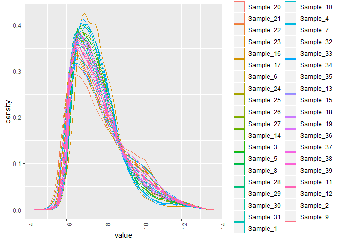
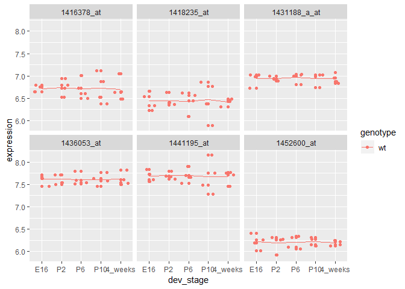

# Dataset & design

```r
expressionMatrix <- read.table(file = "./data/GSE4051_data.tsv", sep = "\t", quote = "", stringsAsFactors = F)

expressionMatrix <- rownames_to_column(expressionMatrix, var = "gene")
expressionMatrix <- as.tibble(expressionMatrix) 

expressionMatrix
```

```
## # A tibble: 29,949 x 40
##    gene  Sample_20 Sample_21 Sample_22 Sample_23 Sample_16 Sample_17
##    <chr>     <dbl>     <dbl>     <dbl>     <dbl>     <dbl>     <dbl>
##  1 1415~      7.24      7.41      7.17      7.07      7.38      7.34
##  2 1415~      9.48     10.0       9.85     10.1       7.64     10.0 
##  3 1415~     10.0      10.0       9.91      9.91      8.42     10.2 
##  4 1415~      8.36      8.37      8.40      8.49      8.36      8.37
##  5 1415~      8.59      8.62      8.52      8.64      8.51      8.89
##  6 1415~      9.59      9.72      9.71      9.7       9.66      9.61
##  7 1415~      9.68     10.4       9.87     10.2       8.04     10.0 
##  8 1415~      7.24      7.90      7.48      7.49      7.34      7.34
##  9 1415~     11.7      11.5      11.5      11.6      10.5      11.8 
## 10 1415~      9.21     10.1       9.82      9.92      8.22      9.60
## # ... with 29,939 more rows, and 33 more variables: Sample_6 <dbl>,
## #   Sample_24 <dbl>, Sample_25 <dbl>, Sample_26 <dbl>, Sample_27 <dbl>,
## #   Sample_14 <dbl>, Sample_3 <dbl>, Sample_5 <dbl>, Sample_8 <dbl>,
## #   Sample_28 <dbl>, Sample_29 <dbl>, Sample_30 <dbl>, Sample_31 <dbl>,
## #   Sample_1 <dbl>, Sample_10 <dbl>, Sample_4 <dbl>, Sample_7 <dbl>,
## #   Sample_32 <dbl>, Sample_33 <dbl>, Sample_34 <dbl>, Sample_35 <dbl>,
## #   Sample_13 <dbl>, Sample_15 <dbl>, Sample_18 <dbl>, Sample_19 <dbl>,
## #   Sample_36 <dbl>, Sample_37 <dbl>, Sample_38 <dbl>, Sample_39 <dbl>,
## #   Sample_11 <dbl>, Sample_12 <dbl>, Sample_2 <dbl>, Sample_9 <dbl>
```


```r
samplesMetadata <- read.table("./data/GSE4051_design.txt",  sep = "\t", header = TRUE, stringsAsFactors = FALSE)

samplesMetadata <- samplesMetadata %>% as_tibble() 

# define our own column names for samples metadata for clarity
names(samplesMetadata) <- c("sample_id", "sample_number", "dev_stage", "genotype")

samplesMetadata
```

```
## # A tibble: 39 x 4
##    sample_id sample_number dev_stage genotype
##    <chr>             <int> <chr>     <chr>   
##  1 Sample_20            20 E16       wt      
##  2 Sample_21            21 E16       wt      
##  3 Sample_22            22 E16       wt      
##  4 Sample_23            23 E16       wt      
##  5 Sample_16            16 E16       NrlKO   
##  6 Sample_17            17 E16       NrlKO   
##  7 Sample_6              6 E16       NrlKO   
##  8 Sample_24            24 P2        wt      
##  9 Sample_25            25 P2        wt      
## 10 Sample_26            26 P2        wt      
## # ... with 29 more rows
```

Convert `dev_stage` and `genotype` to factors:  

```r
samplesMetadata$dev_stage <- factor(samplesMetadata$dev_stage, levels = c("E16", "P2", "P6", "P10", "4_weeks"))
samplesMetadata$genotype <- factor(samplesMetadata$genotype, levels = c("wt", "NrlKO"))
```

Check dimensions of expression and metadata:  

```r
ncol(expressionMatrix)-1 # because "gene" is a column
```

```
## [1] 39
```

```r
nrow(samplesMetadata)
```

```
## [1] 39
```

Check that the sample names match:  

```r
identical(colnames(expressionMatrix[,2:ncol(expressionMatrix)]), samplesMetadata$sample_id)
```

```
## [1] TRUE
```


# QC Plots  

```r
meltedExpressionMatrix <- expressionMatrix %>% melt(id = "gene") 

meltedExpressionMatrix %>% 
  ggplot(aes(x = variable, y = value)) +
  geom_boxplot() +
  theme(axis.text.x = element_text(angle = 90, hjust = 1))
```

<!-- -->


```r
meltedExpressionMatrix %>% 
  ggplot(aes(x = value, color = variable)) +
  geom_density() +
  theme(axis.text.x = element_text(angle = 90, hjust = 1))
```

<!-- -->

> Conclusion: The distribution of gene expression is similar across samples, as expected.  

# Single gene approach
## Plot expression of 2 probes across 2 genotype groups  

```r
geneIds <- c("1416119_at", "1431708_a_at")

# use dplyr::filter() to get the expression data for the gene
expressionDataForGene <- filter(meltedExpressionMatrix, gene %in% geneIds)

# reformat, change column titles, and join with metadata
expressionDataForGene <- select(expressionDataForGene, variable, gene, value) %>%
  rename(sample_id = variable, expression = value) %>%
  arrange(gene) %>%
  left_join(samplesMetadata, by = "sample_id")

expressionDataForGene
```

```
##    sample_id         gene expression sample_number dev_stage genotype
## 1  Sample_20   1416119_at     10.580            20       E16       wt
## 2  Sample_21   1416119_at     11.000            21       E16       wt
## 3  Sample_22   1416119_at     10.850            22       E16       wt
## 4  Sample_23   1416119_at     10.920            23       E16       wt
## 5  Sample_16   1416119_at      9.203            16       E16    NrlKO
## 6  Sample_17   1416119_at     11.010            17       E16    NrlKO
## 7   Sample_6   1416119_at     10.900             6       E16    NrlKO
## 8  Sample_24   1416119_at     10.380            24        P2       wt
## 9  Sample_25   1416119_at     10.610            25        P2       wt
## 10 Sample_26   1416119_at     10.250            26        P2       wt
## 11 Sample_27   1416119_at      9.745            27        P2       wt
## 12 Sample_14   1416119_at     10.660            14        P2    NrlKO
## 13  Sample_3   1416119_at     10.620             3        P2    NrlKO
## 14  Sample_5   1416119_at     10.200             5        P2    NrlKO
## 15  Sample_8   1416119_at      9.437             8        P2    NrlKO
## 16 Sample_28   1416119_at      8.821            28        P6       wt
## 17 Sample_29   1416119_at     10.320            29        P6       wt
## 18 Sample_30   1416119_at     10.500            30        P6       wt
## 19 Sample_31   1416119_at      9.452            31        P6       wt
## 20  Sample_1   1416119_at     10.080             1        P6    NrlKO
## 21 Sample_10   1416119_at     10.670            10        P6    NrlKO
## 22  Sample_4   1416119_at     10.160             4        P6    NrlKO
## 23  Sample_7   1416119_at      9.105             7        P6    NrlKO
## 24 Sample_32   1416119_at     10.210            32       P10       wt
## 25 Sample_33   1416119_at      9.216            33       P10       wt
## 26 Sample_34   1416119_at      8.988            34       P10       wt
## 27 Sample_35   1416119_at      9.751            35       P10       wt
## 28 Sample_13   1416119_at      9.838            13       P10    NrlKO
## 29 Sample_15   1416119_at      9.548            15       P10    NrlKO
## 30 Sample_18   1416119_at     10.090            18       P10    NrlKO
## 31 Sample_19   1416119_at      9.447            19       P10    NrlKO
## 32 Sample_36   1416119_at      9.577            36   4_weeks       wt
## 33 Sample_37   1416119_at      8.437            37   4_weeks       wt
## 34 Sample_38   1416119_at      9.417            38   4_weeks       wt
## 35 Sample_39   1416119_at      8.834            39   4_weeks       wt
## 36 Sample_11   1416119_at      9.382            11   4_weeks    NrlKO
## 37 Sample_12   1416119_at      9.002            12   4_weeks    NrlKO
## 38  Sample_2   1416119_at      9.066             2   4_weeks    NrlKO
## 39  Sample_9   1416119_at     10.350             9   4_weeks    NrlKO
## 40 Sample_20 1431708_a_at      9.946            20       E16       wt
## 41 Sample_21 1431708_a_at     10.100            21       E16       wt
## 42 Sample_22 1431708_a_at      9.828            22       E16       wt
## 43 Sample_23 1431708_a_at      9.984            23       E16       wt
## 44 Sample_16 1431708_a_at      7.732            16       E16    NrlKO
## 45 Sample_17 1431708_a_at      6.846            17       E16    NrlKO
## 46  Sample_6 1431708_a_at      6.893             6       E16    NrlKO
## 47 Sample_24 1431708_a_at      9.804            24        P2       wt
## 48 Sample_25 1431708_a_at      8.987            25        P2       wt
## 49 Sample_26 1431708_a_at      8.989            26        P2       wt
## 50 Sample_27 1431708_a_at      9.003            27        P2       wt
## 51 Sample_14 1431708_a_at      7.539            14        P2    NrlKO
## 52  Sample_3 1431708_a_at      7.401             3        P2    NrlKO
## 53  Sample_5 1431708_a_at      7.503             5        P2    NrlKO
## 54  Sample_8 1431708_a_at      7.645             8        P2    NrlKO
## 55 Sample_28 1431708_a_at      8.571            28        P6       wt
## 56 Sample_29 1431708_a_at     10.640            29        P6       wt
## 57 Sample_30 1431708_a_at      9.275            30        P6       wt
## 58 Sample_31 1431708_a_at      8.579            31        P6       wt
## 59  Sample_1 1431708_a_at      7.190             1        P6    NrlKO
## 60 Sample_10 1431708_a_at      7.270            10        P6    NrlKO
## 61  Sample_4 1431708_a_at      7.531             4        P6    NrlKO
## 62  Sample_7 1431708_a_at      7.746             7        P6    NrlKO
## 63 Sample_32 1431708_a_at     10.710            32       P10       wt
## 64 Sample_33 1431708_a_at      9.490            33       P10       wt
## 65 Sample_34 1431708_a_at      8.947            34       P10       wt
## 66 Sample_35 1431708_a_at      8.530            35       P10       wt
## 67 Sample_13 1431708_a_at      7.729            13       P10    NrlKO
## 68 Sample_15 1431708_a_at      7.689            15       P10    NrlKO
## 69 Sample_18 1431708_a_at      7.146            18       P10    NrlKO
## 70 Sample_19 1431708_a_at      7.578            19       P10    NrlKO
## 71 Sample_36 1431708_a_at     10.050            36   4_weeks       wt
## 72 Sample_37 1431708_a_at      9.703            37   4_weeks       wt
## 73 Sample_38 1431708_a_at     10.080            38   4_weeks       wt
## 74 Sample_39 1431708_a_at      9.873            39   4_weeks       wt
## 75 Sample_11 1431708_a_at      7.107            11   4_weeks    NrlKO
## 76 Sample_12 1431708_a_at      8.315            12   4_weeks    NrlKO
## 77  Sample_2 1431708_a_at      7.538             2   4_weeks    NrlKO
## 78  Sample_9 1431708_a_at      9.579             9   4_weeks    NrlKO
```

Plot and assess whether probes appear differentially expressed:  

```r
expressionDataForGene %>% 
  ggplot(aes(x = expression, y = genotype, color = genotype)) + 
  geom_point(size = 3, shape = 1) +
  facet_wrap(~gene)
```

<!-- -->

> Interim conclusion: Probe 1416119_at does not appear differentially expressed, and probe 1431708_a_at appears differentially expressed between wt and NrlKO.  

## T-tests

Perform a t-test comparing expression of the probe 1416119_at in NrlKO vs. wt:

```r
boringGene <- filter(expressionDataForGene, gene == "1416119_at")

t.test(expression ~ genotype, data = boringGene)
```

```
## 
## 	Welch Two Sample t-test
## 
## data:  expression by genotype
## t = -0.18395, df = 36.534, p-value = 0.8551
## alternative hypothesis: true difference in means is not equal to 0
## 95 percent confidence interval:
##  -0.5079125  0.4233967
## sample estimates:
##    mean in group wt mean in group NrlKO 
##            9.892900            9.935158
```

> Conclusion: There is no significant difference in expression of 1416119_at between wt and NrlKO.

Perform a t-test comparing expression of the probe 1431708_a_at in NrlKO vs. wt:

```r
interestingGene <- filter(expressionDataForGene, gene == "1431708_a_at")

(t_interesting <- t.test(expression ~ genotype, data = interestingGene))
```

```
## 
## 	Welch Two Sample t-test
## 
## data:  expression by genotype
## t = 9.838, df = 36.89, p-value = 7.381e-12
## alternative hypothesis: true difference in means is not equal to 0
## 95 percent confidence interval:
##  1.569556 2.383870
## sample estimates:
##    mean in group wt mean in group NrlKO 
##            9.554450            7.577737
```

> Conclusion: Expression of 1431708_a_at is significantly lower in NrlKO vs. wt (Welch's Two Sample t-test p-value = 7.3807264\times 10^{-12}).  


## Linear regressions  

Perform linear regression comparing expression of the probe 1416119_at in NrlKO vs. wt: 

```r
summary(lm(expression ~ genotype, boringGene))
```

```
## 
## Call:
## lm(formula = expression ~ genotype, data = boringGene)
## 
## Residuals:
##     Min      1Q  Median      3Q     Max 
## -1.4559 -0.5257  0.1448  0.6460  1.1071 
## 
## Coefficients:
##               Estimate Std. Error t value Pr(>|t|)    
## (Intercept)    9.89290    0.16104  61.432   <2e-16 ***
## genotypeNrlKO  0.04226    0.23072   0.183    0.856    
## ---
## Signif. codes:  0 '***' 0.001 '**' 0.01 '*' 0.05 '.' 0.1 ' ' 1
## 
## Residual standard error: 0.7202 on 37 degrees of freedom
## Multiple R-squared:  0.0009058,	Adjusted R-squared:  -0.0261 
## F-statistic: 0.03355 on 1 and 37 DF,  p-value: 0.8557
```

> Conclusions: The p-value for genotypeNrlKO is very similar to the t-test p-value.  


Perform a linear regression comparing expression of the probe 1431708_a_at in NrlKO vs. wt: 

```r
summary(lm(expression ~ genotype, interestingGene))
```

```
## 
## Call:
## lm(formula = expression ~ genotype, data = interestingGene)
## 
## Residuals:
##      Min       1Q   Median       3Q      Max 
## -1.02445 -0.45124 -0.03874  0.29605  2.00126 
## 
## Coefficients:
##               Estimate Std. Error t value Pr(>|t|)    
## (Intercept)     9.5545     0.1406   67.94  < 2e-16 ***
## genotypeNrlKO  -1.9767     0.2015   -9.81 7.71e-12 ***
## ---
## Signif. codes:  0 '***' 0.001 '**' 0.01 '*' 0.05 '.' 0.1 ' ' 1
## 
## Residual standard error: 0.629 on 37 degrees of freedom
## Multiple R-squared:  0.7223,	Adjusted R-squared:  0.7148 
## F-statistic: 96.24 on 1 and 37 DF,  p-value: 7.713e-12
```

> Conclusions: The p-value for genotypeNrlKO is very similar to the t-test p-value.  


# High-throughput approach  
## Identify genes that differ across developmental stages in wt (baseline = E16), using Limma  

Filter wild type samples only, so we can focus on effect of developmental stage only:  

```r
wildTypeSamples <- filter(samplesMetadata, genotype == "wt")

wildTypeExpressionMatrix <- column_to_rownames(expressionMatrix, var = "gene") %>%
  select(wildTypeSamples$sample_id)
```

```
## Warning: Setting row names on a tibble is deprecated.
```

```r
identical(colnames(wildTypeExpressionMatrix), wildTypeSamples$sample_id, attrib.as.set = T) # check to make sure the columns are in same order for metadata and expression matrix
```

```
## [1] TRUE
```

Construct design matrix:  

```r
designMatrix <- model.matrix(~dev_stage, wildTypeSamples) # function model.matrix() creates a design matrix (using the "reference-treatment effect" Parameterization design)

head(designMatrix, 10)
```

```
##    (Intercept) dev_stageP2 dev_stageP6 dev_stageP10 dev_stage4_weeks
## 1            1           0           0            0                0
## 2            1           0           0            0                0
## 3            1           0           0            0                0
## 4            1           0           0            0                0
## 5            1           1           0            0                0
## 6            1           1           0            0                0
## 7            1           1           0            0                0
## 8            1           1           0            0                0
## 9            1           0           1            0                0
## 10           1           0           1            0                0
```

```r
head(wildTypeSamples, 10)
```

```
## # A tibble: 10 x 4
##    sample_id sample_number dev_stage genotype
##    <chr>             <int> <fct>     <fct>   
##  1 Sample_20            20 E16       wt      
##  2 Sample_21            21 E16       wt      
##  3 Sample_22            22 E16       wt      
##  4 Sample_23            23 E16       wt      
##  5 Sample_24            24 P2        wt      
##  6 Sample_25            25 P2        wt      
##  7 Sample_26            26 P2        wt      
##  8 Sample_27            27 P2        wt      
##  9 Sample_28            28 P6        wt      
## 10 Sample_29            29 P6        wt
```


Run limma and get TopTable:  

```r
wildTypeDevStageFit <- lmFit(object = wildTypeExpressionMatrix, design = designMatrix) # function lmFit() fits a linear model for each gene
wildTypeDevStageFitEb <- eBayes(wildTypeDevStageFit) # function eBayes() computes moderated t-statistic for each gene 

topTenGenes <- topTable(wildTypeDevStageFitEb) # function topTable() gives you ranked list of genes with summary data from lmFit/eBayes (note: number = Inf gives all genes instead of top)
```

```
## Removing intercept from test coefficients
```

```r
topTenGenes
```

```
##              dev_stageP2 dev_stageP6 dev_stageP10 dev_stage4_weeks AveExpr
## 1440645_at       0.39900     0.19525      0.92000          3.96125 6.52835
## 1416041_at       0.15800     0.47975      0.33275          5.11450 9.38250
## 1425222_x_at     0.88200     0.79950      1.54875          5.53175 7.02815
## 1451635_at       1.30250     1.19000      2.01600          6.18825 8.31860
## 1429028_at      -2.44325    -3.40725     -4.31050         -4.60175 8.04495
## 1422929_s_at    -2.91175    -3.61825     -3.54725         -3.66125 7.27830
## 1424852_at       0.45750     0.22975      0.57400          3.97900 7.45405
## 1425171_at       0.99800     3.05300      5.27875          6.07875 9.62045
## 1451617_at       0.72550     2.51275      4.98375          6.68475 8.81660
## 1451618_at       0.60275     2.89025      5.05075          6.28825 9.43065
##                     F      P.Value    adj.P.Val
## 1440645_at   425.4464 1.587779e-17 4.755241e-13
## 1416041_at   195.4574 1.522363e-14 2.279662e-10
## 1425222_x_at 173.3572 4.348283e-14 4.340891e-10
## 1451635_at   157.3341 1.013031e-13 7.584816e-10
## 1429028_at   148.7971 1.645967e-13 9.202951e-10
## 1422929_s_at 146.8672 1.843725e-13 9.202951e-10
## 1424852_at   143.2443 2.290408e-13 9.799345e-10
## 1425171_at   138.8483 3.001762e-13 1.123747e-09
## 1451617_at   136.4774 3.485203e-13 1.159759e-09
## 1451618_at   134.2025 4.031647e-13 1.207438e-09
```


### Plot top 6 differentially expressed probes  

```r
geneIds <- rownames(topTenGenes[1:6,])

# use dplyr::filter() to get the expression data for the gene
expressionDataForGene <- filter(meltedExpressionMatrix, gene %in% geneIds)

# reformat, change column titles, and join with metadata, then filter to wt
expressionDataForGene <- select(expressionDataForGene, variable, gene, value) %>%
  rename(sample_id = variable, expression = value) %>%
  arrange(gene) %>%
  left_join(samplesMetadata, by = "sample_id") %>%
  filter(genotype == "wt")
```

```
## Warning: Column `sample_id` joining factor and character vector, coercing
## into character vector
```

```r
expressionDataForGene
```

```
##     sample_id         gene expression sample_number dev_stage genotype
## 1   Sample_20   1416041_at      8.478            20       E16       wt
## 2   Sample_21   1416041_at      7.742            21       E16       wt
## 3   Sample_22   1416041_at      8.287            22       E16       wt
## 4   Sample_23   1416041_at      8.155            23       E16       wt
## 5   Sample_24   1416041_at      8.174            24        P2       wt
## 6   Sample_25   1416041_at      8.659            25        P2       wt
## 7   Sample_26   1416041_at      8.110            26        P2       wt
## 8   Sample_27   1416041_at      8.351            27        P2       wt
## 9   Sample_28   1416041_at      8.395            28        P6       wt
## 10  Sample_29   1416041_at      8.371            29        P6       wt
## 11  Sample_30   1416041_at      8.742            30        P6       wt
## 12  Sample_31   1416041_at      9.073            31        P6       wt
## 13  Sample_32   1416041_at      9.142            32       P10       wt
## 14  Sample_33   1416041_at      8.128            33       P10       wt
## 15  Sample_34   1416041_at      8.160            34       P10       wt
## 16  Sample_35   1416041_at      8.563            35       P10       wt
## 17  Sample_36   1416041_at     13.050            36   4_weeks       wt
## 18  Sample_37   1416041_at     13.250            37   4_weeks       wt
## 19  Sample_38   1416041_at     13.320            38   4_weeks       wt
## 20  Sample_39   1416041_at     13.500            39   4_weeks       wt
## 21  Sample_20 1422929_s_at      9.883            20       E16       wt
## 22  Sample_21 1422929_s_at     10.700            21       E16       wt
## 23  Sample_22 1422929_s_at      9.441            22       E16       wt
## 24  Sample_23 1422929_s_at     10.080            23       E16       wt
## 25  Sample_24 1422929_s_at      7.008            24        P2       wt
## 26  Sample_25 1422929_s_at      7.423            25        P2       wt
## 27  Sample_26 1422929_s_at      7.015            26        P2       wt
## 28  Sample_27 1422929_s_at      7.011            27        P2       wt
## 29  Sample_28 1422929_s_at      6.546            28        P6       wt
## 30  Sample_29 1422929_s_at      6.341            29        P6       wt
## 31  Sample_30 1422929_s_at      6.403            30        P6       wt
## 32  Sample_31 1422929_s_at      6.341            31        P6       wt
## 33  Sample_32 1422929_s_at      6.384            32       P10       wt
## 34  Sample_33 1422929_s_at      6.597            33       P10       wt
## 35  Sample_34 1422929_s_at      6.412            34       P10       wt
## 36  Sample_35 1422929_s_at      6.522            35       P10       wt
## 37  Sample_36 1422929_s_at      6.278            36   4_weeks       wt
## 38  Sample_37 1422929_s_at      6.341            37   4_weeks       wt
## 39  Sample_38 1422929_s_at      6.445            38   4_weeks       wt
## 40  Sample_39 1422929_s_at      6.395            39   4_weeks       wt
## 41  Sample_20 1425222_x_at      5.494            20       E16       wt
## 42  Sample_21 1425222_x_at      4.791            21       E16       wt
## 43  Sample_22 1425222_x_at      5.565            22       E16       wt
## 44  Sample_23 1425222_x_at      5.253            23       E16       wt
## 45  Sample_24 1425222_x_at      6.165            24        P2       wt
## 46  Sample_25 1425222_x_at      5.790            25        P2       wt
## 47  Sample_26 1425222_x_at      6.408            26        P2       wt
## 48  Sample_27 1425222_x_at      6.268            27        P2       wt
## 49  Sample_28 1425222_x_at      6.126            28        P6       wt
## 50  Sample_29 1425222_x_at      5.898            29        P6       wt
## 51  Sample_30 1425222_x_at      6.037            30        P6       wt
## 52  Sample_31 1425222_x_at      6.240            31        P6       wt
## 53  Sample_32 1425222_x_at      7.656            32       P10       wt
## 54  Sample_33 1425222_x_at      6.449            33       P10       wt
## 55  Sample_34 1425222_x_at      6.572            34       P10       wt
## 56  Sample_35 1425222_x_at      6.621            35       P10       wt
## 57  Sample_36 1425222_x_at     10.460            36   4_weeks       wt
## 58  Sample_37 1425222_x_at     10.880            37   4_weeks       wt
## 59  Sample_38 1425222_x_at     10.780            38   4_weeks       wt
## 60  Sample_39 1425222_x_at     11.110            39   4_weeks       wt
## 61  Sample_20   1429028_at     11.030            20       E16       wt
## 62  Sample_21   1429028_at     11.090            21       E16       wt
## 63  Sample_22   1429028_at     10.800            22       E16       wt
## 64  Sample_23   1429028_at     11.070            23       E16       wt
## 65  Sample_24   1429028_at      8.785            24        P2       wt
## 66  Sample_25   1429028_at      8.583            25        P2       wt
## 67  Sample_26   1429028_at      8.294            26        P2       wt
## 68  Sample_27   1429028_at      8.555            27        P2       wt
## 69  Sample_28   1429028_at      6.938            28        P6       wt
## 70  Sample_29   1429028_at      7.814            29        P6       wt
## 71  Sample_30   1429028_at      8.098            30        P6       wt
## 72  Sample_31   1429028_at      7.511            31        P6       wt
## 73  Sample_32   1429028_at      6.459            32       P10       wt
## 74  Sample_33   1429028_at      7.167            33       P10       wt
## 75  Sample_34   1429028_at      6.501            34       P10       wt
## 76  Sample_35   1429028_at      6.621            35       P10       wt
## 77  Sample_36   1429028_at      6.469            36   4_weeks       wt
## 78  Sample_37   1429028_at      6.377            37   4_weeks       wt
## 79  Sample_38   1429028_at      6.712            38   4_weeks       wt
## 80  Sample_39   1429028_at      6.025            39   4_weeks       wt
## 81  Sample_20   1440645_at      5.449            20       E16       wt
## 82  Sample_21   1440645_at      5.417            21       E16       wt
## 83  Sample_22   1440645_at      5.514            22       E16       wt
## 84  Sample_23   1440645_at      5.353            23       E16       wt
## 85  Sample_24   1440645_at      5.740            24        P2       wt
## 86  Sample_25   1440645_at      5.797            25        P2       wt
## 87  Sample_26   1440645_at      5.851            26        P2       wt
## 88  Sample_27   1440645_at      5.941            27        P2       wt
## 89  Sample_28   1440645_at      5.704            28        P6       wt
## 90  Sample_29   1440645_at      5.493            29        P6       wt
## 91  Sample_30   1440645_at      5.486            30        P6       wt
## 92  Sample_31   1440645_at      5.831            31        P6       wt
## 93  Sample_32   1440645_at      6.677            32       P10       wt
## 94  Sample_33   1440645_at      6.233            33       P10       wt
## 95  Sample_34   1440645_at      6.222            34       P10       wt
## 96  Sample_35   1440645_at      6.281            35       P10       wt
## 97  Sample_36   1440645_at      9.480            36   4_weeks       wt
## 98  Sample_37   1440645_at      9.347            37   4_weeks       wt
## 99  Sample_38   1440645_at      9.394            38   4_weeks       wt
## 100 Sample_39   1440645_at      9.357            39   4_weeks       wt
## 101 Sample_20   1451635_at      6.476            20       E16       wt
## 102 Sample_21   1451635_at      5.744            21       E16       wt
## 103 Sample_22   1451635_at      6.424            22       E16       wt
## 104 Sample_23   1451635_at      6.073            23       E16       wt
## 105 Sample_24   1451635_at      7.469            24        P2       wt
## 106 Sample_25   1451635_at      7.014            25        P2       wt
## 107 Sample_26   1451635_at      7.749            26        P2       wt
## 108 Sample_27   1451635_at      7.695            27        P2       wt
## 109 Sample_28   1451635_at      7.410            28        P6       wt
## 110 Sample_29   1451635_at      6.877            29        P6       wt
## 111 Sample_30   1451635_at      7.575            30        P6       wt
## 112 Sample_31   1451635_at      7.615            31        P6       wt
## 113 Sample_32   1451635_at      9.098            32       P10       wt
## 114 Sample_33   1451635_at      7.756            33       P10       wt
## 115 Sample_34   1451635_at      7.906            34       P10       wt
## 116 Sample_35   1451635_at      8.021            35       P10       wt
## 117 Sample_36   1451635_at     11.960            36   4_weeks       wt
## 118 Sample_37   1451635_at     12.490            37   4_weeks       wt
## 119 Sample_38   1451635_at     12.400            38   4_weeks       wt
## 120 Sample_39   1451635_at     12.620            39   4_weeks       wt
```


```r
ggplot(expressionDataForGene, aes(dev_stage, expression, color = genotype)) +
  geom_point() +
  geom_jitter() +
  stat_summary(aes(y = expression, group = 1), fun.y = mean, geom="line") +
  facet_wrap(~gene)
```

<!-- -->

```r
# Make a function that filters to genes of interest and then reformats data and plots same as above (in "wt" only)
plotGenes <- function(geneIds, meltedExpressionMatrix, samplesMetadata){
  expressionDataForGene <- filter(meltedExpressionMatrix, gene %in% geneIds)
  expressionDataForGene <- select(expressionDataForGene, variable, gene, value) %>%
  rename(sample_id = variable, expression = value) %>%
  arrange(gene) %>%
  left_join(samplesMetadata, by = "sample_id") %>%
  filter(genotype == "wt")
  
  ggplot(expressionDataForGene, aes(dev_stage, expression, color = genotype)) +
  geom_point() +
  geom_jitter() +
  stat_summary(aes(y = expression, group = 1), fun.y = mean, geom="line") +
  facet_wrap(~gene)
}

plotGenes(geneIds, meltedExpressionMatrix, samplesMetadata) # check to make sure it works
```

```
## Warning: Column `sample_id` joining factor and character vector, coercing
## into character vector
```

<!-- -->


### Plot probes that are not differentially expressed  

```r
allGenes <- topTable(wildTypeDevStageFitEb, number = Inf)
```

```
## Removing intercept from test coefficients
```

```r
(boringGenes <- tail(allGenes))
```

```
##              dev_stageP2 dev_stageP6 dev_stageP10 dev_stage4_weeks AveExpr
## 1452600_at      -0.02575    -0.01750     -0.00575         -0.03150 6.20265
## 1416378_at       0.03650    -0.00075      0.01500         -0.00825 6.71775
## 1418235_at       0.00075    -0.00700      0.03500         -0.01500 6.44150
## 1431188_a_at     0.00575     0.02725      0.00875          0.00125 6.94585
## 1441195_at       0.01450     0.01400     -0.01475         -0.00750 7.68300
## 1436053_at      -0.00175    -0.00850     -0.00925         -0.00500 7.61335
##                        F   P.Value adj.P.Val
## 1452600_at   0.027650520 0.9983752 0.9985419
## 1416378_at   0.024051269 0.9987635 0.9988969
## 1418235_at   0.023367662 0.9988315 0.9989005
## 1431188_a_at 0.023344402 0.9988338 0.9989005
## 1441195_at   0.015007091 0.9995115 0.9995449
## 1436053_at   0.002772688 0.9999830 0.9999830
```


```r
geneIds <- rownames(boringGenes)

plotGenes(geneIds, meltedExpressionMatrix, samplesMetadata)
```

```
## Warning: Column `sample_id` joining factor and character vector, coercing
## into character vector
```

<!-- -->


## Fit custom contrast matrix to limma model to compare different groups  

```r
# make custom contrast matrix
contrastMatrix <- makeContrasts(
  p10vsp6 = dev_stageP10 - dev_stageP6,
  fourweeksVsP10 = dev_stage4_weeks - dev_stageP10,
  levels = designMatrix
) # function makeContrasts() allows you to compare desired groups, given an existing design matrix (levels = designMatrix)
```

```
## Warning in makeContrasts(p10vsp6 = dev_stageP10 - dev_stageP6,
## fourweeksVsP10 = dev_stage4_weeks - : Renaming (Intercept) to Intercept
```

```r
contrastMatrix
```

```
##                   Contrasts
## Levels             p10vsp6 fourweeksVsP10
##   Intercept              0              0
##   dev_stageP2            0              0
##   dev_stageP6           -1              0
##   dev_stageP10           1             -1
##   dev_stage4_weeks       0              1
```


```r
# fit the contrasts using the original Limma model
contrastFit <- contrasts.fit(wildTypeDevStageFit, contrastMatrix) # function contrasts.fit() allows you to fit new contrasts to an existing lmFit() result, by providing a new contrast matrix generated with makeContrasts()
```

```
## Warning in contrasts.fit(wildTypeDevStageFit, contrastMatrix): row names of
## contrasts don't match col names of coefficients
```

```r
contrastFitEb <- eBayes(contrastFit)

contrastGenes <- topTable(contrastFitEb)

contrastGenes
```

```
##               p10vsp6 fourweeksVsP10 AveExpr        F      P.Value
## 1440645_at    0.72475        3.04125 6.52835 632.7410 2.224325e-17
## 1416041_at   -0.14700        4.78175 9.38250 302.3940 1.472973e-14
## 1425222_x_at  0.74925        3.98300 7.02815 235.3682 1.299509e-13
## 1424852_at    0.34425        3.40500 7.45405 225.1087 1.910320e-13
## 1420726_x_at  0.17325        3.55125 7.19000 203.5215 4.555385e-13
## 1451635_at    0.82600        4.17225 8.31860 200.0177 5.289072e-13
## 1429394_at   -0.09800        2.40975 7.84825 167.4991 2.416043e-12
## 1455447_at   -0.97650       -1.79975 9.97295 153.5444 5.063369e-12
## 1429791_at    0.24800        1.65825 8.02555 145.7407 7.877494e-12
## 1422612_at    0.48375        3.42600 8.83255 142.2388 9.676005e-12
##                 adj.P.Val
## 1440645_at   6.661631e-13
## 1416041_at   2.205703e-10
## 1425222_x_at 1.297300e-09
## 1424852_at   1.430304e-09
## 1420726_x_at 2.640040e-09
## 1451635_at   2.640040e-09
## 1429394_at   1.033687e-08
## 1455447_at   1.895536e-08
## 1429791_at   2.621367e-08
## 1422612_at   2.840295e-08
```


### Plot the top 6 differentially-expressed genes in the new limma result with 2 contrasts

```r
plotGenes(rownames(contrastGenes[1:6,]), meltedExpressionMatrix, samplesMetadata)
```

```
## Warning: Column `sample_id` joining factor and character vector, coercing
## into character vector
```

<!-- -->

> Note: All of these happen to be probes that are differentially expressed between 4-weeks and P10, but no difference between P10 and P6.  

### Set p-value cutoff and identify probes that are differentially expressed desired contrast

```r
cutoff <- 1e-04
wtResCont <- decideTests(contrastFitEb, p.value = cutoff, method = "global") # function decideTests() identifies differentially expressed genes (at a given cutoff) between your contrasts (for a contrasts.fit() result); note, see later for use of this function on lmFit/eBayes result without contrasts.fit

summary(wtResCont) # function summary() when applied to decideTests() result gives you a count of all significantly up/down genes for each contrast
```

```
##        p10vsp6 fourweeksVsP10
## Down         4              8
## NotSig   29945          29895
## Up           0             46
```

> Note: Only 4 genes are differentially P10 vs. P6  

#### Differential expression in P10 vs. P6

```r
hits1 <- as.data.frame(wtResCont) %>%
  rownames_to_column(var = "gene") %>%
  filter(p10vsp6 < 0)

plotGenes(geneIds = hits1$gene, meltedExpressionMatrix, samplesMetadata)
```

```
## Warning: Column `sample_id` joining factor and character vector, coercing
## into character vector
```

<!-- -->


#### Selected differentially expressed genes in 4-weeks vs. P10 (4 downregulated)  

```r
hits2 <- as.data.frame(wtResCont) %>%
  rownames_to_column(var = "gene") %>%
  filter(fourweeksVsP10 < 0)

plotGenes(geneIds = hits2[1:4,]$gene, meltedExpressionMatrix, samplesMetadata)
```

```
## Warning: Column `sample_id` joining factor and character vector, coercing
## into character vector
```

<!-- -->


## Assess interaction between genotype and developmental stage

First make simplified dataset considering the dev stages E16 & 4-weeks only:  

```r
interactionSamples <- filter(samplesMetadata, dev_stage %in% c("E16", "4_weeks"))

# IMPORTANT - you want to adjust factor levels here to eliminate stages P2, P6, and P10 from your design matrix
interactionSamples$dev_stage <- interactionSamples$dev_stage %>% 
  as.character() %>% 
  factor(levels = c("E16", "4_weeks"))

interactionExpressionMatrix <- column_to_rownames(expressionMatrix, var = "gene") %>%
  select(interactionSamples$sample_id)
```

```
## Warning: Setting row names on a tibble is deprecated.
```

```r
identical(colnames(interactionExpressionMatrix), interactionSamples$sample_id, attrib.as.set = T) # check to make sure the columns are in same order for metadata and expression matrix
```

```
## [1] TRUE
```

Make design matrix with interaction term:  

```r
interactionDesign <- model.matrix(~genotype*dev_stage, interactionSamples)

interactionDesign # note that the intercept is still the E16 stage, since it is the first factor level
```

```
##    (Intercept) genotypeNrlKO dev_stage4_weeks
## 1            1             0                0
## 2            1             0                0
## 3            1             0                0
## 4            1             0                0
## 5            1             1                0
## 6            1             1                0
## 7            1             1                0
## 8            1             0                1
## 9            1             0                1
## 10           1             0                1
## 11           1             0                1
## 12           1             1                1
## 13           1             1                1
## 14           1             1                1
## 15           1             1                1
##    genotypeNrlKO:dev_stage4_weeks
## 1                               0
## 2                               0
## 3                               0
## 4                               0
## 5                               0
## 6                               0
## 7                               0
## 8                               0
## 9                               0
## 10                              0
## 11                              0
## 12                              1
## 13                              1
## 14                              1
## 15                              1
## attr(,"assign")
## [1] 0 1 2 3
## attr(,"contrasts")
## attr(,"contrasts")$genotype
## [1] "contr.treatment"
## 
## attr(,"contrasts")$dev_stage
## [1] "contr.treatment"
```

Run limma with interaction design matrix:  

```r
interactionFit <- lmFit(interactionExpressionMatrix, interactionDesign)
interactionFitEb <- eBayes(interactionFit)

interactionAll <- topTable(interactionFitEb, number = Inf)
```

```
## Removing intercept from test coefficients
```

```r
head(interactionAll, 10)
```

```
##              genotypeNrlKO dev_stage4_weeks genotypeNrlKO.dev_stage4_weeks
## 1451618_at      0.21608333          6.28825                    -6.13208333
## 1451617_at      0.28408333          6.68475                    -6.87433333
## 1460212_at      0.30625000          5.79325                    -5.76250000
## 1425171_at      0.01225000          6.07875                    -5.81475000
## 1421061_at      0.29183333          6.05350                     0.10316667
## 1455098_a_at   -0.14075000          5.49325                    -0.49700000
## 1458418_at     -0.04500000          6.34650                    -5.91725000
## 1451590_at     -0.26083333          4.95400                    -0.03166667
## 1451647_at     -0.05983333          5.79850                    -5.21666667
## 1420484_a_at   -0.01158333          5.02575                    -0.55591667
##               AveExpr        F      P.Value    adj.P.Val
## 1451618_at   8.283600 879.3647 1.664656e-16 4.985479e-12
## 1451617_at   7.699867 753.4162 5.018679e-16 5.260441e-12
## 1460212_at   9.232733 745.2092 5.426619e-16 5.260441e-12
## 1425171_at   8.235867 718.7119 7.025865e-16 5.260441e-12
## 1421061_at   9.513733 667.2588 1.193317e-15 7.147728e-12
## 1455098_a_at 7.778267 554.4248 4.465675e-15 2.229042e-11
## 1458418_at   6.986867 525.0126 6.581959e-15 2.816044e-11
## 1451590_at   9.485467 475.8156 1.325023e-14 4.960391e-11
## 1451647_at   7.775000 435.6206 2.480441e-14 8.254079e-11
## 1420484_a_at 8.796000 417.5622 3.350105e-14 1.003323e-10
```

Find genes with interaction between genotype and dev_stage:  

```r
interactionGenes <- decideTests(object = interactionFitEb, p.value = 1e-06, method = "global") # function decideTests() can also be used to identify significant results from a standard lmFit/eBayes result

summary(interactionGenes)
```

```
##        (Intercept) genotypeNrlKO dev_stage4_weeks
## Down             0             1               39
## NotSig           0         29948            29642
## Up           29949             0              268
##        genotypeNrlKO:dev_stage4_weeks
## Down                               28
## NotSig                          29904
## Up                                 17
```

Look for down regulation across developmental stages in wt but up regulation in genotypeNrlKO:  

```r
geneIds <- as.data.frame(interactionGenes) %>%
  rownames_to_column(var = "gene") %>%
  filter(dev_stage4_weeks < 0, `genotypeNrlKO:dev_stage4_weeks` > 0) %>% # this selects genes that are downregulated at 4 weeks in the 1st-level genotype (wt), but that go up in the alternative genotype at 4 weeks
  select(gene) %>% unlist()

# tweak the plotGenes function for this new task
plotGenes2 <- function(geneIds, meltedExpressionMatrix, samplesMetadata){
  expressionDataForGene <- filter(meltedExpressionMatrix, gene %in% geneIds)
  expressionDataForGene <- select(expressionDataForGene, variable, gene, value) %>%
  rename(sample_id = variable, expression = value) %>%
  arrange(gene) %>%
  left_join(samplesMetadata, by = "sample_id") %>%
  filter(dev_stage %in% c("E16", "4_weeks"))
  
  expressionDataForGene$dev_stage <- expressionDataForGene$dev_stage %>% as.numeric() # this is necessary to get geom_smooth to work
  
  ggplot(expressionDataForGene, aes(dev_stage, expression, color = genotype)) +
  geom_point() +
  geom_jitter() +
    geom_smooth(method = "lm", se = F) +
  facet_wrap(~gene)
}

plotGenes2(geneIds[1:4], meltedExpressionMatrix, samplesMetadata)
```

```
## Warning: Column `sample_id` joining factor and character vector, coercing
## into character vector
```

<!-- -->


# Deliverable  
Make a similar plot but this time for 4 genes where there is no interaction between genotype and developmental stages.  

```r
geneIds <- as.data.frame(interactionGenes) %>%
  rownames_to_column(var = "gene") %>%
  filter(dev_stage4_weeks < 0, `genotypeNrlKO:dev_stage4_weeks` == 0) %>%
  select(gene) %>% unlist()

plotGenes2(geneIds[5:8], meltedExpressionMatrix, samplesMetadata)
```

```
## Warning: Column `sample_id` joining factor and character vector, coercing
## into character vector
```

<!-- -->

