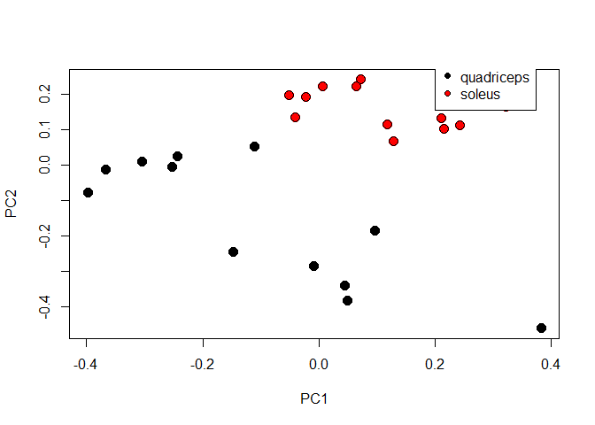

# GSE70213 nebulin knockout microarray data


```r
if (file.exists("GSE70213.Rdata")) {
    # if previously downloaded
    load("GSE70213.Rdata")
} else {
    # Get geo object that contains our data and phenotype information
    geo_obj <- getGEO("GSE70213", GSEMatrix = TRUE)
    geo_obj <- geo_obj[[1]]
    save(geo_obj, file = "GSE70213.Rdata")
}
# Get expression data
data <- exprs(geo_obj)

# Get covariate data
prDes <- pData(geo_obj)[, c("organism_ch1", "title", colnames(pData(geo_obj))[grep("characteristics", 
    colnames(pData(geo_obj)))])]

## Clean up covariate data
colnames(prDes) = c("organism", "sample_name", "tissue", "genotype", "sex", "age")
prDes$tissue = as.factor(gsub("tissue: ", "", prDes$tissue))
prDes$genotype = as.factor(gsub("genotype: ", "", prDes$genotype))
prDes$sex = as.factor(gsub("Sex: ", "", prDes$sex))
prDes$age = gsub("age: ", "", prDes$age)
```

# Exploratory analysis

## Dimensions


```r
data[1:6, 1:5] %>% kable()
```

             GSM1720833    GSM1720834    GSM1720835    GSM1720836    GSM1720837
---------  ------------  ------------  ------------  ------------  ------------
10338001    2041.408000   2200.861000   2323.760000   3216.263000   2362.775000
10338002      63.780590     65.084380     58.308200     75.861450     66.956050
10338003     635.390400    687.393600    756.004000   1181.929000    759.099800
10338004     251.566800    316.997300    320.513200    592.806000    359.152500
10338005       2.808835      2.966376      2.985357      3.352954      3.155735
10338006       3.573085      3.816430      3.815323      4.690040      3.862684


```r
dim(data)
```

```
## [1] 35557    24
```


```r
head(prDes)
```

```
##                organism    sample_name     tissue genotype  sex
## GSM1720833 Mus musculus quad-control-1 quadriceps  control male
## GSM1720834 Mus musculus quad-control-2 quadriceps  control male
## GSM1720835 Mus musculus quad-control-3 quadriceps  control male
## GSM1720836 Mus musculus quad-control-4 quadriceps  control male
## GSM1720837 Mus musculus quad-control-5 quadriceps  control male
## GSM1720838 Mus musculus quad-control-6 quadriceps  control male
##                    age
## GSM1720833 41 days old
## GSM1720834 41 days old
## GSM1720835 41 days old
## GSM1720836 41 days old
## GSM1720837 42 days old
## GSM1720838 40 days old
```

```r
dim(prDes)
```

```
## [1] 24  6
```

## Frequency distribution

```r
hist(data, col = "gray", main = "GSE70213 - Histogram")
```

<!-- -->


```r
hist(log2(data), col = "gray", main = "GSE70213 - Log2 Histogram")
```

<!-- -->

## Rescale rows to mean=0, var=1


```r
sprDat <- t(scale(t(data)))

round(data.frame(avgBefore = rowMeans(head(data)), avgAfter = rowMeans(head(sprDat)), 
    varBefore = apply(head(data), 1, var), varAfter = apply(head(sprDat), 1, var)), 
    2) %>% head() %>% kable()
```

            avgBefore   avgAfter   varBefore   varAfter
---------  ----------  ---------  ----------  ---------
10338001      2109.42          0   110944.28          1
10338002        55.62          0       70.82          1
10338003       645.76          0    22386.92          1
10338004       280.43          0     7513.48          1
10338005         2.92          0        0.02          1
10338006         3.64          0        0.07          1


# Part I: Agglomerative hierarchical clustering

* Setup using Euclidean distances (recommended):


```r
data_to_plot <- sprDat

# pairwise distances
pr.dis <- dist(t(data_to_plot), method = "euclidean")

# create additional interaction term between tissue and genotype in prDes design matrix
prDes$grp <- with(prDes, interaction(tissue, genotype))

head(prDes) %>% kable()
```

             organism       sample_name      tissue       genotype   sex    age           grp                
-----------  -------------  ---------------  -----------  ---------  -----  ------------  -------------------
GSM1720833   Mus musculus   quad-control-1   quadriceps   control    male   41 days old   quadriceps.control 
GSM1720834   Mus musculus   quad-control-2   quadriceps   control    male   41 days old   quadriceps.control 
GSM1720835   Mus musculus   quad-control-3   quadriceps   control    male   41 days old   quadriceps.control 
GSM1720836   Mus musculus   quad-control-4   quadriceps   control    male   41 days old   quadriceps.control 
GSM1720837   Mus musculus   quad-control-5   quadriceps   control    male   42 days old   quadriceps.control 
GSM1720838   Mus musculus   quad-control-6   quadriceps   control    male   40 days old   quadriceps.control 

## Compare hierarchical clustering linkage types

* Recommended = average linkage.


```r
# compute hierarchical clustering using different linkage types
pr.hc.s <- hclust(pr.dis, method = "single")
pr.hc.c <- hclust(pr.dis, method = "complete")
pr.hc.a <- hclust(pr.dis, method = "average")
pr.hc.w <- hclust(pr.dis, method = "ward.D")

# plot them
op <- par(mar = c(1, 4, 4, 2), mfrow = c(2, 2))

plot(pr.hc.s, labels = FALSE, main = "Single", xlab = "")
plot(pr.hc.c, labels = FALSE, main = "Complete", xlab = "")
plot(pr.hc.a, labels = FALSE, main = "Average", xlab = "")
plot(pr.hc.w, labels = FALSE, main = "Ward", xlab = "")
```

<!-- -->

## Plot heatmap

```r
# set pheatmap clustering parameters
clust_dist_col = "euclidean"  #‘'correlation'’ for Pearson correlation, ‘'euclidean'’, ‘'maximum'’, ‘'manhattan'’, ‘'canberra'’, ‘'binary'’ or ‘'minkowski'’
clust_method = "ward.D2"  #‘'ward.D'’, ‘'ward.D2'’,‘'single'’, ‘'complete'’, ‘'average'’ (= UPGMA), ‘'mcquitty'’ (= WPGMA), ‘'median'’ (= WPGMC) or ‘'centroid'’ (= UPGMC)
clust_scale = "none"  #'column', 'none', 'row'

## the annotation option uses the covariate object (prDes) we defined. It should
## have the same rownames, as the colnames in our data object (data_to_plot).

pheatmap(data_to_plot, cluster_rows = FALSE, scale = clust_scale, clustering_method = clust_method, 
    clustering_distance_cols = clust_dist_col, show_colnames = T, show_rownames = FALSE, 
    main = "Clustering heatmap for GSE70213", annotation = prDes[, c("tissue", "genotype", 
        "grp")])
```

<!-- -->

### Exercise: Play with the options of the pheatmap function and compare the different heatmaps. 

* Change colours of annotations:


```r
pal <- brewer.pal.info # view pallete info from RColourBrewer

palset <- brewer.pal(10, "Paired")

var1 = c(palset[1], palset[2])
names(var1) = levels(prDes$tissue) # this sets the names of each to match the factors in "tissue"

var2 = c(palset[5], palset[6])
names(var2) = levels(prDes$genotype)

var3 = c(palset[3], palset[4], palset[9], palset[10])
names(var3) = levels(as.factor(prDes$grp))

covar_color <- list(tissue = var1, genotype = var2, grp = var3) 

(my_heatmap_obj <- pheatmap(data_to_plot, cluster_rows = FALSE, scale = clust_scale, clustering_method = clust_method, 
    clustering_distance_cols = clust_dist_col, show_colnames = T, show_rownames = FALSE, 
    main = "Clustering heatmap for GSE70213", annotation = prDes[, c("tissue", "genotype", 
        "grp")],
    annotation_colors = covar_color))
```

<!-- -->

### Extract clusters from heatmap

```r
cluster_samples <- cutree(my_heatmap_obj$tree_col, k = 10) # for clustering by sample, use tree_col

#cluster_genes <- cutree(my_heatmap_obj$tree_row, k = 100) # for clustering by genes, use tree_row; leaving out for now because clustering by row takes too long

kable(head(cluster_samples))
```

               x
-----------  ---
GSM1720833     1
GSM1720834     1
GSM1720835     1
GSM1720836     2
GSM1720837     1
GSM1720838     3

```r
#kable(head(cluster_genes))
```


# Part II: Parametric and alternative non-parametric clustering with PCA and t-SNE

## k-means clustering

* Notes:
    - _How it works:_ Pre-determine the number of clusters, then iteratively pick different cluster representatives (centroids), and assign the closest remaining samples to it, until the solution converges to stable clusters. The centroids are not data objects in k-means clustering, just random numbers that converge to the means of clusters.
    - Set the parameter `nstart` to a larger number (50) to get reproducible result every time
    - Assumptions about the data for k-means clustering:
        - Variance of distribution of each variable (in our case, genes) is spherical
        - All variables have the same variance
        - A prior probability that all k clusters have the same number of members
      
* Perform k-means clustering of samples using all genes (~35K):


```r
# Objects in columns
set.seed(31)
k <- 5
pr.km <- kmeans(t(data_to_plot), centers = k, nstart = 50)

# Look at composition of each cluster
pr.kmTable <- data.frame(exptStage = prDes$grp, cluster = pr.km$cluster)

ggplot(pr.kmTable, aes(factor(cluster), fill = exptStage)) +
  geom_bar() +
  ggtitle("Cluster composition by experimental group") +
  labs(x = "Cluster number", fill = "Exp. group") +
  theme_gray(base_size = 12)
```

<!-- -->

* Repeat the analysis using a different set.seed value:


```r
# Objects in columns
set.seed(100)
k <- 5
pr.km <- kmeans(t(data_to_plot), centers = k, nstart = 50)

# Look at composition of each cluster
pr.kmTable <- data.frame(exptStage = prDes$grp, cluster = pr.km$cluster)

ggplot(pr.kmTable, aes(factor(cluster), fill = exptStage)) +
  geom_bar() +
  ggtitle("Cluster composition by experimental group") +
  labs(x = "Cluster number", fill = "Exp. group") +
  theme_gray(base_size = 12)
```

<!-- -->

> Observations: The composition of the 5 clusters was the same regardless of set.seed value, meaning that the clustering is replicable.

## k-mediods clustering / Partitioning around mediods (PAM)

* Notes:
    - _How it works:_ K representative objects (mediods) are chosen as cluster centers (centroids), and then objects are assigned to the clusters where they have a minimum dissimilarity. The centroids are data objects (unlike in k-means clustering), so this method is more robust to outliers. 
    - This methods can accept raw data OR a dissimilarity matrix (`diss = TRUE`).


```r
set.seed(31)

pr.pam <- pam(pr.dis, k = k)
pr.pamTable <- data.frame(exptStage = prDes$grp, cluster = pr.pam$clustering)

ggplot(pr.pamTable, aes(factor(cluster), fill = exptStage)) +
  geom_bar() +
  ggtitle("Cluster composition by experimental group") +
  labs(x = "Cluster number", fill = "Exp. group") +
  theme_gray(base_size = 12)
```

<!-- -->


```r
# save Summary of PAM results:
pam.smr <- summary(pr.pam)
```


### Evaluation of PAM clustering result

#### Silhouette plot

* A silhouette plot compares dissimilarity of each sample _within_ its own cluster vs. _between_ clusters.
    - A value close to 1 means that the object is more similar to objects within its own cluster compared to objects in other clusters.  


```r
op <- par(mar = c(5, 1, 4, 4))
plot(pr.pam, main = "Silhouette Plot for 5 clusters")
```

<!-- -->


# Clustering take-home problems

### Question 1: Was 5 the best choice for number of clusters?

* I will compare average silhouette widths across a range of k values to determine which k produces an average silhouette value closest to 1.


```r
sil.widths <- list(n.clusters = list(NA), avg.sil.width = list(NA))

for(i in 2:10) {
  pr.pam <- pam(pr.dis, k = i)
  avg.sil.width <- pr.pam$silinfo$avg.width
  sil.widths$n.clusters[i] <- i
  sil.widths$avg.sil.width[i] <- avg.sil.width
}

sil.widths.df <- as.data.frame(matrix(unlist(sil.widths), nrow=length(unlist(sil.widths[1])))) %>%
  na.omit()

colnames(sil.widths.df) <- c("n.clusters", "avg.sil.width")

# plot results
ggplot(sil.widths.df, aes(n.clusters, avg.sil.width)) +
  geom_point() +
  stat_summary(aes(y = avg.sil.width, group=1), fun.y = mean, geom="line") +
  theme_gray(base_size = 12) +
  ggtitle("Average silhouette width for k = n clusters") +
  labs(x = "k-value (n clusters)", y = "Average silhouette width")
```

<!-- -->


```r
# determine the k-value where average silhouette width is maximized
optimal.k <- sil.widths.df[which(sil.widths.df$avg.sil.width == max(sil.widths.df$avg.sil.width)),]$n.clusters
```

> The optimal k-value to maximize the average silhouette width is 4.

> Therefore, 5 was not the best choice of k value.

### Question 2: For a common choice of k, compare the clustering across different methods, e.g. hierarchical (pruned to specific k), k-means, PAM. 

* I will compare results of these clustering methods for k=4.

#### Hierarchical clustering

```r
hc <- hclust(pr.dis, method = "ward.D2")
k4.hc <- cutree(hc, k = 4) %>% as.data.frame()
colnames(k4.hc) <- "cluster"
k4.hc$exptStage <- prDes[match(rownames(k4.hc), rownames(prDes)),]$grp

ggplot(k4.hc, aes(factor(cluster), fill = exptStage)) +
  geom_bar() +
  ggtitle("Cluster composition by experimental group") +
  labs(x = "Cluster number", fill = "Exp. group") +
  theme_gray(base_size = 12)
```

<!-- -->

* Summary: 
    - quadriceps.control mostly clusters together (cluster 1) but has 1 sample that is an outlier (cluster 2)
    - quadriceps.nebulin KO clusters together (cluster 3)
    - the two soleus samples cluster together (cluster 4)
    
* The lone sample in cluster 2 is: GSM1720836
    
#### k-means clustering

```r
set.seed(31)
k <- 4
pr.km <- kmeans(t(data_to_plot), centers = k, nstart = 50)

# Look at composition of each cluster
pr.kmTable <- data.frame(exptStage = prDes$grp, cluster = pr.km$cluster)

ggplot(pr.kmTable, aes(factor(cluster), fill = exptStage)) +
  geom_bar() +
  ggtitle("Cluster composition by experimental group") +
  labs(x = "Cluster number", fill = "Exp. group") +
  theme_gray(base_size = 12)
```

<!-- -->

* The lone sample in cluster 1 is (again): GSM1720836

* Summary:
    - samples are split the same as in the hierarchical clustering
    - however, the cluster numbers are assigned differently, so they differ between the clustering methods
    
#### PAM clustering

```r
set.seed(31)

pr.pam <- pam(pr.dis, k = k)
pr.pamTable <- data.frame(exptStage = prDes$grp, cluster = pr.pam$clustering)

ggplot(pr.pamTable, aes(factor(cluster), fill = exptStage)) +
  geom_bar() +
  ggtitle("Cluster composition by experimental group") +
  labs(x = "Cluster number", fill = "Exp. group") +
  theme_gray(base_size = 12)
```

<!-- -->

* The single sample in cluster 2 is (again): GSM1720836
* Now another sample from the quadriceps.control group splits off and clusters with quadriceps.nebulin KO; sample name: GSM1720838

* Summary:
    - samples are split quite similarly to the other 2 clustering methods, but 2 outliers in the quadriceps.control group are split from the rest instead of 1 as in the other methods
    
> Comparison of all 3 methods:

* __Label switching:__ The "cluster number" is assigned differently, so these are not replicated between the 3 clustering methods.
* __Cluster composition comparison:__ Despite differences in cluster number (doesn't really matter anyway), the sample composition in the 4 clusters is identical between the hierarchical clustering method and the k-means clustering method. The PAM clustering method differs from the other methods in the way the quadriceps.control group is assigned to clusters, with two outliers being separated in different clusters from the remaining quadriceps.control samples clustering together.


## Clustering by gene

* Limit the genes to top differentially expressed genes (limma):


```r
cutoff <- 1e-05
DesMat <- model.matrix(~grp, prDes)
dsFit <- lmFit(sprDat, DesMat)
dsEbFit <- eBayes(dsFit)
dsHits <- topTable(dsEbFit, coef = grep("grp", colnames(coef(dsEbFit))), p.value = cutoff, 
    n = Inf)
numBHhits <- nrow(dsHits)

topGenes <- rownames(dsHits)

# Scaled data of topGenes
topDat <- sprDat[topGenes, ]
```


### Hierarchical clustering by gene

```r
pheatmap(topDat, cluster_rows = TRUE, scale = "none", clustering_method = "average", 
    clustering_distance_cols = "euclidean", clustering_distance_rows = "euclidean", 
    annotation = prDes[, c("tissue", "genotype", "grp")], show_rownames = FALSE, 
    annotation_colors = covar_color)
```

<!-- -->

### Partitioning methods

* Visualize the average expression of genes in a gene cluster (here cluster 2) of interest across all samples:


```r
set.seed(1234)
k <- 5
kmeans.genes <- kmeans(topDat, centers = k)

# choose which cluster we want
clusterNum <- 2

# Set up the axes without plotting; ylim set based on trial run.
plot(kmeans.genes$centers[clusterNum, ], ylim = c(-2.5, 4), type = "n", xlab = "", 
    ylab = "Relative expression", xaxt = "n", frame.plot = F)
par(mar = c(4, 4, 4, 2))

# Plot the expression of all the genes in the selected cluster in grey.
matlines(y = t(topDat[kmeans.genes$cluster == clusterNum, ]), col = "grey")

# Add the cluster center. This is last so it isn't underneath the members
points(kmeans.genes$centers[clusterNum, ], type = "l")

# Optional: colored points to show which stage the samples are from.
points(kmeans.genes$centers[clusterNum, ], col = prDes$grp, pch = 20)


# Add axis text with sample labels

    # first check that the samples are in same order in kmeans.genes and in prDes
    identical(rownames(prDes), colnames(kmeans.genes$centers), attrib.as.set = T)
```

```
## [1] TRUE
```

```r
par(mgp = c(0, -1.9, -3))
axis(side = 1, at = 1:24, labels = prDes$sample_name, las = 2)
```

<!-- -->

## Evaluating clusters

### Choosing the right k using AIC

* The __Akaike information criterion (AIC)__ is an estimator of the relative quality of statistical models for a given set of data. Given a collection of models for the data, AIC estimates the quality of each model, relative to each of the other models. Thus, AIC provides a means for model selection.
    - source: [https://en.wikipedia.org/wiki/Akaike_information_criterion](https://en.wikipedia.org/wiki/Akaike_information_criterion)


```r
set.seed(31)

k_max <- 10  # the max number of clusters to explore clustering with 
km_fit <- list()  # create empty list to store the kmeans object

for (i in 1:k_max) {
    k_cluster <- kmeans(t(sprDat), centers = i, nstart = 50)
    km_fit[[i]] <- k_cluster
}


# calculate AIC
km_AIC <- function(km_cluster) {
    m <- ncol(km_cluster$centers)
    n <- length(km_cluster$cluster)
    k <- nrow(km_cluster$centers)
    D <- km_cluster$tot.withinss
    return(D + 2 * m * k)
}

aic <- sapply(km_fit, km_AIC) # for each element in the km_fit list, calculate the AIC using the km_AIC function (above)
plot(x = seq(1, k_max), y = aic, xlab = "Number of clusters", ylab = "AIC", pch = 20, cex = 2, 
    main = "Clustering Samples: AIC")
```

<!-- -->

```r
# calculate BIC
km_BIC <- function(km_cluster) {
    m <- ncol(km_cluster$centers)
    n <- length(km_cluster$cluster)
    k <- nrow(km_cluster$centers)
    D <- km_cluster$tot.withinss
    return(D + log(n) * m * k)
}

bic <- sapply(km_fit, km_BIC)
plot(seq(1, k_max), bic, xlab = "Number of clusters", ylab = "BIC", pch = 20, cex = 2, 
    main = "Clustering Samples: BIC")
```

<!-- -->

```r
# the ideal number of clusters is at the "elbow" point of these curves
```

> By comparing the "elbow" point of both the AIC and BIC curves, the ideal number of clusters appears to be 3.


### Assessing the uncertainty in hierarchical cluster analysis: pvclust bootstrapping

* pvclust provides two types of p-values: 
    - AU (Approximately Unbiased) p-value, computed by multiscale bootstrap resampling 
    - BP (Bootstrap Probability) p-value, computed by normal bootstrap resampling
        - AU p-value is a better approximation to unbiased p-value
        
    - Clusters with AU larger than 95% are highlighted by rectangles, which are strongly supported by data.


```r
pvc <- pvclust(topDat, nboot = 100)
```

```
## Bootstrap (r = 0.5)... Done.
## Bootstrap (r = 0.6)... Done.
## Bootstrap (r = 0.7)... Done.
## Bootstrap (r = 0.8)... Done.
## Bootstrap (r = 0.9)... Done.
## Bootstrap (r = 1.0)... Done.
## Bootstrap (r = 1.1)... Done.
## Bootstrap (r = 1.2)... Done.
## Bootstrap (r = 1.3)... Done.
## Bootstrap (r = 1.4)... Done.
```


```r
plot(pvc, labels = prDes$grp, cex = 0.6)
pvrect(pvc, alpha = 0.95)
```

<!-- -->


## Feature reduction

### PCA plots

* PCA assumes that the most important characteristics of our data are the ones with the largest variance.
* Furthermore, it takes our data and organizes it in such a way that redundancy is removed as the most important variables are listed first. 
* The new variables will be linear combinations of the original variables, with different weights.

* _Available methods:_
    - prcomp()
    - svd()


```r
pcs <- prcomp(x = sprDat, scale. = F, center = F) # Scaling (and centering) is suppressed because we already scaled the rows. You can experiment with this to see what happens.

# scree plot
plot(pcs)
```

<!-- -->


```r
# append the rotations for the first 10 PCs to the phenodata
# the rotation is a matrix with samples as rows and PCs as columns
prinComp <- cbind(prDes, pcs$rotation[rownames(prDes), 1:10])

# scatter plot showing us how the first few PCs relate to covariates
plot(prinComp[, c("genotype", "tissue", "PC1", "PC2", "PC3")], pch = 19, cex = 0.8)
```

<!-- -->

* Now plot first two PCs and see where `tissue` clusters with respect to these PCs:


```r
plot(prinComp[, c("PC1", "PC2")], bg = prDes$tissue, pch = 21, cex = 1.5)
legend(list(x = 0.2, y = 0.3), as.character(levels(prDes$tissue)), pch = 21, pt.bg = c(1, 
    2, 3, 4, 5))
```

<!-- -->

* Observe where `genotype` clusters with respect to these PCs:


```r
plot(prinComp[, c("PC1", "PC2")], bg = prDes$genotype, pch = 21, cex = 1.5)
legend(list(x = 0.2, y = 0.3), as.character(levels(prDes$genotype)), pch = 21, pt.bg = c(1, 
    2, 3, 4, 5))
```

<!-- -->

#### Determining how much of the total variance is captured by each PCA


```r
summary(pcs)
```

```
## Importance of components:
##                           PC1    PC2     PC3     PC4     PC5     PC6
## Standard deviation     2.1235 1.8957 1.49067 1.30336 1.02878 0.92795
## Proportion of Variance 0.1961 0.1562 0.09661 0.07386 0.04602 0.03744
## Cumulative Proportion  0.1961 0.3523 0.44890 0.52276 0.56877 0.60621
##                            PC7     PC8     PC9    PC10    PC11    PC12
## Standard deviation     0.86674 0.83534 0.81621 0.78678 0.77243 0.76143
## Proportion of Variance 0.03266 0.03034 0.02896 0.02691 0.02594 0.02521
## Cumulative Proportion  0.63887 0.66921 0.69817 0.72509 0.75103 0.77623
##                          PC13    PC14    PC15    PC16    PC17    PC18
## Standard deviation     0.7477 0.73139 0.72127 0.70872 0.69406 0.67519
## Proportion of Variance 0.0243 0.02326 0.02262 0.02184 0.02094 0.01982
## Cumulative Proportion  0.8005 0.82379 0.84641 0.86825 0.88919 0.90901
##                           PC19    PC20    PC21    PC22    PC23      PC24
## Standard deviation     0.67423 0.65740 0.64933 0.62812 0.62433 6.079e-15
## Proportion of Variance 0.01976 0.01879 0.01833 0.01715 0.01695 0.000e+00
## Cumulative Proportion  0.92878 0.94757 0.96590 0.98305 1.00000 1.000e+00
```

* Set the `tol` parameter to set the minimum standard deviation cutoff
    - Components are omitted if their standard deviations are less than or equal to tol times the standard deviation of the first component.
    

```r
pcs_2dim = prcomp(sprDat, center = FALSE, scale = FALSE, tol = 0.8)
summary(pcs_2dim)
```

```
## Importance of first k=2 (out of 24) components:
##                           PC1    PC2
## Standard deviation     2.1235 1.8957
## Proportion of Variance 0.1961 0.1562
## Cumulative Proportion  0.1961 0.3523
```


### t-SNE plots

* t-SNE allows for non-linear interactions between our features
* Caveats:
    - Solutions are not deterministic: While in PCA the correct solution to a question is guaranteed, t-SNE can have many multiple minima, and might give many different optimal solutions
    - Clusters are not intuitive: t-SNE collapses similar points in high dimensional space, on top of each other in lower dimensions. This means it maps features that are proximal to each other in a way that global trends may be warped
    - Applying our fit to new data is not possible: t-SNE embedding is generated by moving all our data to a lower dimensional state. It does __not__ give us eigenvectors (like PCA does) that can map new/unseen data to this lower dimensional state


```r
library(Rtsne)
```

```
## Warning: package 'Rtsne' was built under R version 3.5.2
```

```r
colors = rainbow(length(unique(prDes$grp)))
names(colors) = unique(prDes$grp)
tsne <- Rtsne(unique(t(sprDat)), dims = 2, perplexity = 0.1, verbose = TRUE, max_iter = 100)
```

```
## Performing PCA
## Read the 24 x 24 data matrix successfully!
## OpenMP is working. 1 threads.
## Using no_dims = 2, perplexity = 0.100000, and theta = 0.500000
## Computing input similarities...
## Perplexity should be lower than K!
## Building tree...
## Done in 0.00 seconds (sparsity = 0.000000)!
## Learning embedding...
## Iteration 50: error is 0.000000 (50 iterations in 0.01 seconds)
## Iteration 100: error is 0.000000 (50 iterations in 0.01 seconds)
## Fitting performed in 0.02 seconds.
```

```r
plot(tsne$Y, main = "t-SNE")
text(tsne$Y, labels = prDes$grp, col = colors[prDes$grp], cex = 0.6)
```

<!-- -->

* The perplexity value effectively controls how many nearest neighbours are taken into account when constructing the embedding in the low-dimensional space.
    - it appears that the perplexity value here is too low, so we don't really get clustering...?
* Increase perplexity to 1:


```r
tsne_p1 <- Rtsne(unique(t(sprDat)), dims = 2, perplexity = 1, verbose = TRUE, max_iter = 100)
```

```
## Performing PCA
## Read the 24 x 24 data matrix successfully!
## OpenMP is working. 1 threads.
## Using no_dims = 2, perplexity = 1.000000, and theta = 0.500000
## Computing input similarities...
## Building tree...
## Done in 0.00 seconds (sparsity = 0.163194)!
## Learning embedding...
## Iteration 50: error is 62.489392 (50 iterations in 0.01 seconds)
## Iteration 100: error is 58.480260 (50 iterations in 0.01 seconds)
## Fitting performed in 0.02 seconds.
```

```r
plot(tsne_p1$Y, main = "tsne")
text(tsne_p1$Y, labels = prDes$grp, col = colors[prDes$grp], cex = 0.6)
```

<!-- -->


# Deliverables

1.  Regenerate the pheatmap clustering plot for the top genes, selected from limma, using clustering distance: correlation, and clustering method: mcquitty.  


```r
pheatmap(topDat, cluster_rows = TRUE, cluster_cols = TRUE, scale = "none", clustering_method = "mcquitty", 
    clustering_distance_cols = "correlation", clustering_distance_rows = "correlation", 
    annotation = prDes[, c("tissue", "genotype", "grp")], show_rownames = FALSE, 
    annotation_colors = covar_color)
```

<!-- -->

2.  Regenerate the dendrogram on the samples of this heatmap using the hclust and dist functions.  


```r
## Use correlations between variables "as distance"
## see: https://stat.ethz.ch/R-manual/R-devel/library/stats/html/dist.html
geneC.dis <- as.dist((1 - cor(topDat))/2)

geneC.hc.a <- hclust(geneC.dis, method = "mcquitty")

plot(geneC.hc.a, labels = FALSE, main = "Regenerate samples dendrogram", xlab = "")
```

<!-- -->

3.  Plot the data for this analysis along PCs 1 and 2 using ggplot instead of base plotting. Color the points by tissue.  

* First plot PCA on all gene expression data (`prinComp`, see above)

```r
ggplot(prinComp, aes(PC1, PC2, colour = tissue)) +
  geom_point(size = 4) +
  theme_gray(base_size = 12)
```

<!-- -->

* Compare to PCA on top differentially expressed genes from limma (`topDat`)


```r
# perform PCA on top DE genes
pca_top <- prcomp(x = topDat, scale. = F, center = F)

prinComp_top <- cbind(prDes, pca_top$rotation[rownames(prDes), 1:10]) 

# plot
ggplot(prinComp_top, aes(PC1, PC2, colour = tissue)) +
  geom_point(size = 4) +
  theme_gray(base_size = 12)
```

<!-- -->

* Are those separated clusters the different genotypes?


```r
ggplot(prinComp_top, aes(PC1, PC2, colour = tissue, shape = genotype)) +
  geom_point(size = 4) +
  theme_gray(base_size = 12)
```

<!-- -->

