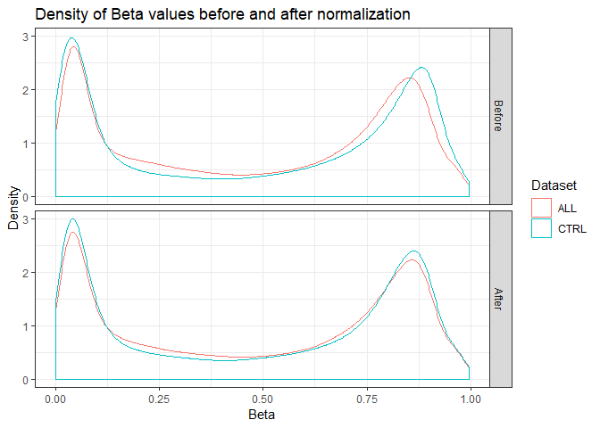
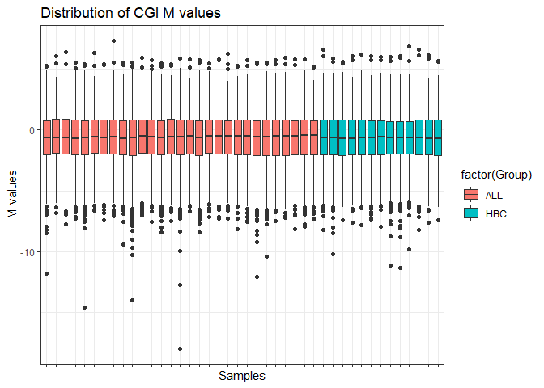
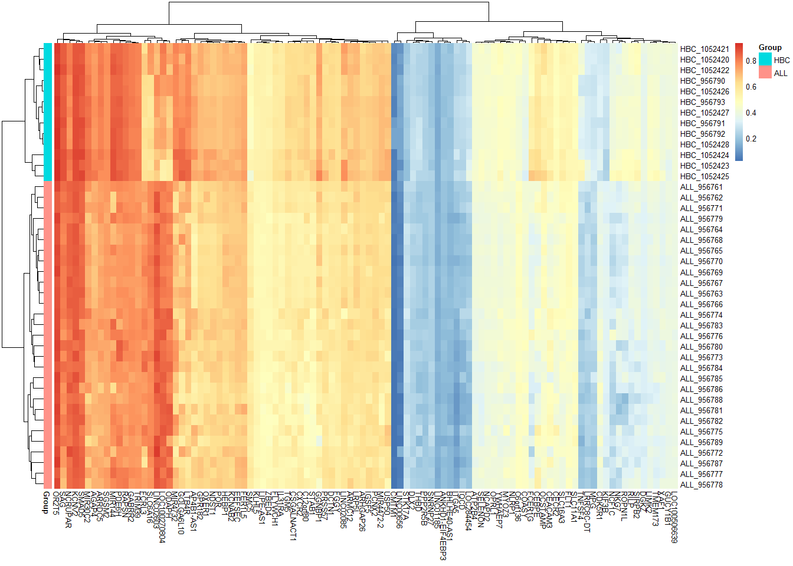
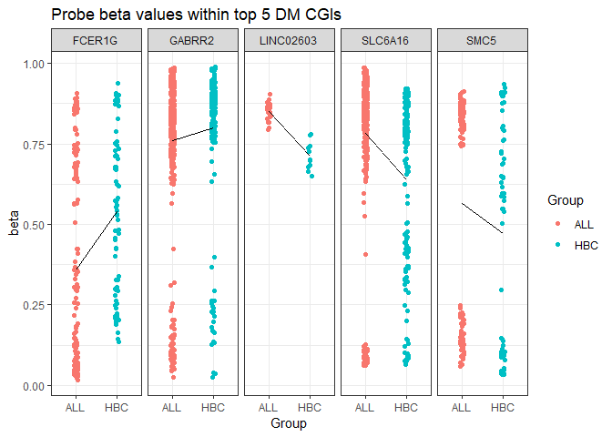
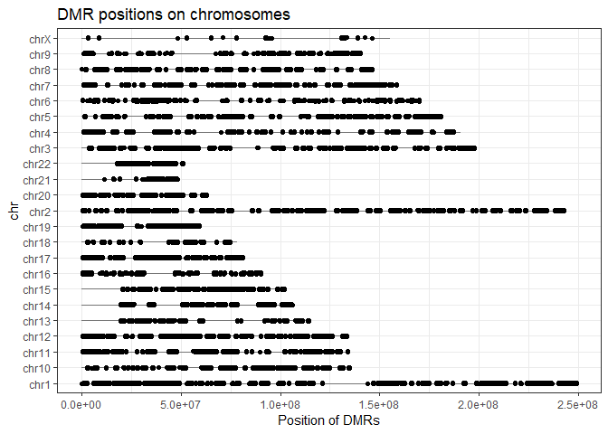
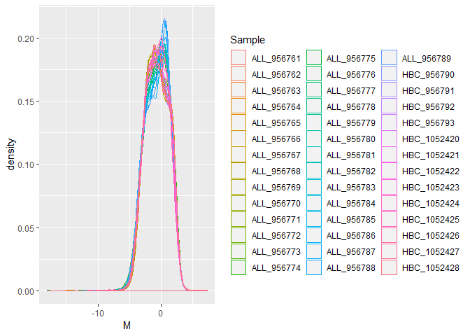
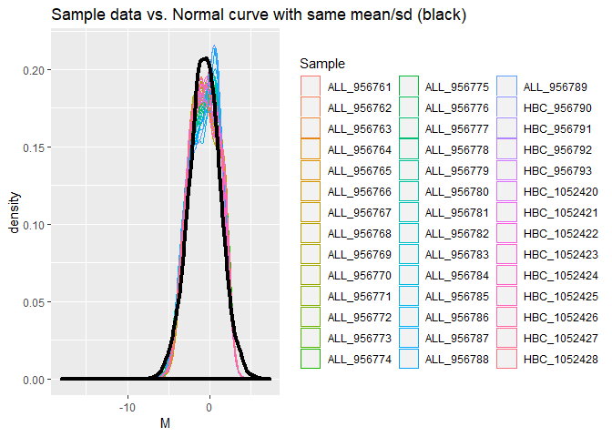

# GEO methylation datasets

```r
if(file.exists("methyl_ALL.RData")){ # if previously downloaded
  load("methyl_ALL.RData")
} else { # if downloading for the first time
  GSE39141 <- getGEO('GSE39141')
  show(GSE39141) ## 33 samples (29 ALL and 4 healthy B cells)
  GSE42865 <- getGEO('GSE42865') # took ~2 mins for JB
  show(GSE42865) ## 16 samples (9 healthy cells B cells and 7 other cells)
  
  # Extract expression matrices (turn into data frames at once) 
  ALL.dat <- as.data.frame(exprs(GSE39141[[1]]))
  CTRL.dat <- as.data.frame(exprs(GSE42865[[1]]))
  
  # Obtain the meta-data for the samples and rename them perhaps?
  ALL.meta <- pData(phenoData(GSE39141[[1]]))
  CTRL.meta <- pData(phenoData(GSE42865[[1]]))
  
  # create some labels
  ALL.meta$Group<- c(rep('ALL', 29), rep('HBC', 4)) 
  ## ALL: Case; HBC: Healthy B Cells
  
  # Subset both meta-data and data for control (healthy) donors
  CTRL.meta <- droplevels(subset(CTRL.meta,
                                 grepl("Healthy donor", characteristics_ch1.1)))
  CTRL.dat <- subset(CTRL.dat, select = as.character(CTRL.meta$geo_accession)) 
  
  # Rename variables
  names(ALL.dat) <- paste(ALL.meta$Group,
                          gsub("GSM", "", names(ALL.dat)), sep = '_')
  names(CTRL.dat) <- paste('HBC', gsub("GSM", "", names(CTRL.dat)), sep = '_')
  
  # save the data to avoid future re-downloading
  save(ALL.dat, CTRL.dat, ALL.meta, CTRL.meta, file = "methyl_ALL.RData")
}
```

# QC and Normalize between experiments

```r
dat.probeMeans <- c(rowMeans(ALL.dat, na.rm = T), rowMeans(CTRL.dat, na.rm = T)) 
plotDat <- data.frame(Beta = dat.probeMeans,
                      Dataset = rep(c('ALL', 'CTRL'), each = nrow(ALL.dat)))
(probeAvg <- ggplot(data = plotDat, aes(x = Beta, col = Dataset)) +
   geom_density() + 
   ggtitle("Average Beta value density of two experiments") + 
   xlab("Beta") + 
   ylab("Density") + 
   theme_bw()
)
```

<!-- -->

Quantile Normalization:

```r
identical(rownames(ALL.dat), rownames(CTRL.dat))
```

```
## [1] TRUE
```

```r
beta.matrix <- as.matrix(cbind(ALL.dat, CTRL.dat))

beta.norm <- normalizeBetweenArrays(beta.matrix)

dat.probeMeans <- c(rowMeans(beta.norm[, 1:ncol(ALL.dat)], na.rm = TRUE),
                    rowMeans(beta.norm[, ncol(ALL.dat):ncol(beta.norm)], na.rm = TRUE)) 
plotNorm <-
  rbind(data.frame(plotDat, Norm = "Before"),
        data.frame(Beta = dat.probeMeans,
                   Dataset = rep(c('ALL', 'CTRL'), each = nrow(ALL.dat)),
                   Norm = "After"))
plotNorm$Norm <- factor(plotNorm$Norm, levels = c("Before", "After"))

(probeAvgNorm <- ggplot(data = plotNorm, aes(x = Beta, col = Dataset)) +
   geom_density() + 
   facet_grid(Norm ~ .) + 
   ggtitle("Density of Beta values before and after normalization") + 
   xlab("Beta") + 
   ylab("Density") + 
   theme_bw()
)
```

<!-- -->

# Convert Beta values to M values

* M value: Logit transformation of Beta value, to convert to scale of -Inf to Inf
* Function for calculating M values: `beta2m()` from the `lumi` package

```r
M.norm <- beta2m(beta.norm)
```


# Focus on CpG Islands (CGIs)

```r
InfiniumMethylation <- features(FDb.InfiniumMethylation.hg19)

## We only want annotations for the hg19 genome  
met <- metadata(FDb.InfiniumMethylation.hg19) ## need to fetch genome
genome(InfiniumMethylation) <- met[which(met[,'name']=='Genome'),'value'] # sets it to hg19 only

InfiniumMethylation <- sort(InfiniumMethylation)
show(InfiniumMethylation)
```

```
## GRanges object with 487173 ranges and 14 metadata columns:
##              seqnames            ranges strand | addressA_450 addressB_450
##                 <Rle>         <IRanges>  <Rle> |  <character>  <character>
##   cg01686861    chr16       60748-60749      + |     36644319     45624454
##   cg05558259    chr16       61085-61086      + |     65765435             
##   cg26978960    chr16       62460-62461      + |     28717484             
##   cg03792876    chr16       73243-73244      + |     42725455             
##   cg09699726    chr16       91602-91603      + |     34629364             
##          ...      ...               ...    ... .          ...          ...
##   cg13808036     chrY 24453658-24453659      - |     47649309             
##   cg26983430     chrY 24549675-24549676      - |     24631411     26605360
##   cg17939569     chrY 27009430-27009431      - |     73757458             
##   cg13365400     chrY 27210334-27210335      - |     61745505             
##   cg14273923     chrY 28555912-28555913      - |     16749405             
##              addressA_27 addressB_27  channel450   channel27   probeType
##              <character> <character> <character> <character> <character>
##   cg01686861        <NA>        <NA>         Red        <NA>          cg
##   cg05558259        <NA>        <NA>        Both        <NA>          cg
##   cg26978960        <NA>        <NA>        Both        <NA>          cg
##   cg03792876        <NA>        <NA>        Both        <NA>          cg
##   cg09699726        <NA>        <NA>        Both        <NA>          cg
##          ...         ...         ...         ...         ...         ...
##   cg13808036        <NA>        <NA>        Both        <NA>          cg
##   cg26983430        <NA>        <NA>         Red        <NA>          cg
##   cg17939569        <NA>        <NA>        Both        <NA>          cg
##   cg13365400        <NA>        <NA>        Both        <NA>          cg
##   cg14273923        <NA>        <NA>        Both        <NA>          cg
##                percentGC    platform
##              <character> <character>
##   cg01686861        0.76       HM450
##   cg05558259        0.56       HM450
##   cg26978960        0.66       HM450
##   cg03792876        0.64       HM450
##   cg09699726        0.68       HM450
##          ...         ...         ...
##   cg13808036        0.64       HM450
##   cg26983430        0.56       HM450
##   cg17939569        0.42       HM450
##   cg13365400        0.44       HM450
##   cg14273923        0.48       HM450
##                                                       sourceSeq
##                                                     <character>
##   cg01686861 CGCCCCCAGGCCGGCGCCGTGCGACTTTGCTCCTGCAACACACGCCCCCC
##   cg05558259 CAGCTAGGGACATTGCAGGCTCCTCTTGCTCAAAGTGTAGTGGCAGCACG
##   cg26978960 CGGCCCAGTAGAGCCCTAGGGGTGACGCCACTCCCACTCACTGTCGACTC
##   cg03792876 ATGGAGGCTTGGGCGGGTCACCCCCAGTGCAGGCCAAGATGCAGGTTACG
##   cg09699726 GCACTAGAGCCCCAGGGCCAGGGGAGACCCAGCATCCAAGGTGCACCACG
##          ...                                                ...
##   cg13808036 CGGCGCCCACCCACTGCTGCCAGCCATCCCGAATTGACAGCTGCAAGGAT
##   cg26983430 CGTACGCCTGAGGGCCAGGCGAACCTCAGGCTCTTTGTCCTACTAAAAAG
##   cg17939569 CGCCTAAATAAGAATAGGAGTAAAGGAGAGTATTACCTCCAAATCACCGG
##   cg13365400 CGTCACCTGGATGCTGGTTTAAGTGATATATGAAAATCCACCCTAAGGAC
##   cg14273923 TGGTATTGGTGAAGTCTACCACTCCAGCTCGTAGACTTCCATAATCGTCG
##               probeStart    probeEnd probeTarget probeExtension
##              <character> <character> <character>    <character>
##   cg01686861       60700       60749       60748        60749.0
##   cg05558259       61037       61086       61085        61086.0
##   cg26978960       62412       62461       62460        62461.0
##   cg03792876       73195       73244       73243        73244.0
##   cg09699726       91554       91603       91602        91603.0
##          ...         ...         ...         ...            ...
##   cg13808036    24453658    24453707    24453658           <NA>
##   cg26983430    24549675    24549724    24549675           <NA>
##   cg17939569    27009430    27009479    27009430           <NA>
##   cg13365400    27210334    27210383    27210334           <NA>
##   cg14273923    28555912    28555961    28555912           <NA>
##   -------
##   seqinfo: 24 sequences from hg19 genome; no seqlengths
```


```r
## Subset to probes that are present in 450k assay  
probes_450k = as.data.frame(InfiniumMethylation[InfiniumMethylation$platform %in% c("BOTH","HM450"),])
probes_450k$Probe_ID = rownames(probes_450k)
cginame_onlycg = probes_450k[probes_450k$probeType == "cg", ]

## get nearest gene names
hm450 <-  getPlatform(platform='HM450', genome='hg19')
```

```
## Fetching coordinates for hg19...
```

```r
probe_UCSC_name = getNearestGene(hm450)

#Restrict our own dataset to probes within CGIs  
beta.inCGI <- beta.norm[rownames(beta.norm) %in% rownames(probe_UCSC_name),]
M.inCGI <- M.norm[rownames(M.norm) %in% rownames(probe_UCSC_name),]
cginame = probe_UCSC_name[rownames(M.inCGI),]
cginame$cginame = cginame$nearestGeneSymbol
cginame$Probe_ID = rownames(cginame)
nrow(M.inCGI)
```

```
## [1] 485577
```

## Change probe names to gene name of gene nearest to CGI

```r
beta.CGI <- aggregate(beta.inCGI, by = list(cginame$nearestGeneSymbol), mean, na.rm = T)
rownames(beta.CGI) <- beta.CGI[, "Group.1"]
beta.CGI <- subset(beta.CGI, select = - Group.1)

M.CGI <- aggregate(M.inCGI, by = list(cginame$nearestGeneSymbol), mean, na.rm = T)
rownames(M.CGI) <- M.CGI[, "Group.1"]
M.CGI <- subset(M.CGI, select = - Group.1)
```


```r
library(reshape2)
```

```
## Warning: package 'reshape2' was built under R version 3.5.2
```

```r
M.CGI.tall <- melt(t(M.CGI), value.name = 'M', varnames = c('Sample', 'CGI'))
M.CGI.tall$Group <- gsub("_[0-9]+", "", M.CGI.tall$Sample)
(M.boxplot <- ggplot(data = M.CGI.tall, aes(Sample, M, fill = factor(Group))) + 
   geom_boxplot() + 
   ggtitle("Distribution of CGI M values") + 
   xlab("Samples") + 
   ylab("M values") + 
   theme_bw() + 
   scale_x_discrete(labels = NULL))
```

```
## Warning: Removed 17441 rows containing non-finite values (stat_boxplot).
```

<!-- -->

# Differential methylation of CGIs using limma

```r
library(limma)
design <-
  data.frame(Group = relevel(factor(gsub("_[0-9]+", "", colnames(M.CGI))),
                             ref = "HBC"), row.names = colnames(M.CGI))
str(design)
```

```
## 'data.frame':	42 obs. of  1 variable:
##  $ Group: Factor w/ 2 levels "HBC","ALL": 2 2 2 2 2 2 2 2 2 2 ...
```


```r
DesMat <- model.matrix(~ Group, design)
head(DesMat)
```

```
##            (Intercept) GroupALL
## ALL_956761           1        1
## ALL_956762           1        1
## ALL_956763           1        1
## ALL_956764           1        1
## ALL_956765           1        1
## ALL_956766           1        1
```


```r
DMRfit <- lmFit(M.CGI, DesMat)
DMRfitEb <- eBayes(DMRfit)
cutoff <- 0.01
DMR <- topTable(DMRfitEb, coef = 'GroupALL', number = Inf, p.value = cutoff)
head(DMR)   # top hits 
```

```
##                logFC    AveExpr         t      P.Value    adj.P.Val
## LINC02603  1.2189997  2.1623616  12.65482 4.803050e-16 9.800624e-12
## SLC6A16    1.1853858  1.8099160  11.56509 9.611196e-15 9.805823e-11
## SMC5       0.8456980  0.1723806  11.14711 3.158427e-14 2.148257e-10
## GABRR2    -0.4506881  2.1276014 -10.90991 6.266944e-14 3.196925e-10
## FCER1G    -1.7373139 -0.8682490 -10.55359 1.778519e-13 7.258135e-10
## ODAPH      1.0424391  1.8333076  10.44994 2.416345e-13 8.217586e-10
##                  B
## LINC02603 25.99214
## SLC6A16   23.18186
## SMC5      22.05879
## GABRR2    21.41029
## FCER1G    20.42087
## ODAPH     20.12967
```

## Plot heatmap of top 100 hits using pheatmap

```r
library(pheatmap)

DMR100 <- topTable(DMRfitEb, coef = 'GroupALL', number = 100)
DMR.CGI <- t(as.matrix(subset(beta.CGI,
                              rownames(beta.CGI) %in% rownames(DMR100))))


pheatmap(mat = DMR.CGI, cluster_cols = T, cluster_rows = T, annotation_row = design)
```

<!-- -->

## Strip plot of top 5 DMRs

```r
DMR5 <- topTable(DMRfitEb, coef = 'GroupALL', number = 5)
beta.DMR5probe <-
  beta.inCGI[cginame[rownames(beta.inCGI),]$cginame %in% rownames(DMR5),]
beta.DMR5probe.tall <-
  melt(beta.DMR5probe, value.name = 'M', varnames = c('Probe_ID', 'Sample'))
beta.DMR5probe.tall$Group <-
  factor(gsub("_[0-9]+", "", beta.DMR5probe.tall$Sample))
beta.DMR5probe.tall$CGI <-
  factor(cginame[as.character(beta.DMR5probe.tall$Probe_ID),]$cginame)
(beta.DMR5.stripplot <-
   ggplot(data = beta.DMR5probe.tall, aes(x = Group, y = M, color = Group)) + 
   geom_point(position = position_jitter(width = 0.05), na.rm = T) + 
   stat_summary(fun.y = mean, aes(group = 1), geom = "line", color = "black") + 
   facet_grid(. ~ CGI) + 
   ggtitle("Probe beta values within top 5 DM CGIs") + 
   xlab("Group") + 
   ylab("beta") + 
   theme_bw())
```

```
## Warning: Removed 1 rows containing non-finite values (stat_summary).
```

<!-- -->

## Plot of DMR positions on chromosomes

```r
chrlen = as.data.frame(seqinfo.hg19)
chrlen$chr = as.character(rownames(chrlen))
chrlen = chrlen[chrlen$chr %in% c("chrX",paste("chr",1:22,sep="")),]
chr <- probes_450k[,c("seqnames","start","Probe_ID")]; colnames(chr) = c("chr","coord","Probe_ID")
coord_big = merge(chr, chrlen, by="chr"); rownames(coord_big) = coord_big$Probe_ID
coord = coord_big[,c("chr","coord")]
# coordinates of probes in DM CGIs
coordDMRprobe <- droplevels(na.omit(coord[cginame[cginame$cginame %in% rownames(DMR),]$Probe_ID,])) 
coordDMRprobe$chr <- as.character(coordDMRprobe$chr)
(coord.plot <- ggplot(data = coordDMRprobe) + 
   geom_linerange(aes(x=chr, ymin = 0, ymax = seqlengths), data = chrlen, alpha = 0.5) + 
   geom_point(aes(x = chr, y = coord),
              position = position_jitter(width = 0.03), na.rm = T) + 
   ggtitle("DMR positions on chromosomes") + 
   ylab("Position of DMRs") +
   xlab("chr") +
   coord_flip() + 
   theme_bw())
```

<!-- -->


# Take-home assignment:

> Using plots generated above (or via) the above analysis, describe how and which linear modelling assumptions are imperfectly satisfied. If assumptions are violated, how does this affect the usage of Limma?

Are the data identically distributed?

```r
ggplot(M.CGI.tall, aes(M)) +
  geom_density(aes(colour = Sample))
```

```
## Warning: Removed 17441 rows containing non-finite values (stat_density).
```

<!-- -->

Mean and standard deviation of ALL vs HBC samples:

```r
# calculate mean of each, but remove Inf, -Inf first
filter(M.CGI.tall, !M %in% c("Inf", "-Inf")) %>%
group_by(Group) %>%
  summarise(mean = mean(M, na.rm = T),
            stdev = sd(M, na.rm = T))
```

```
## # A tibble: 2 x 3
##   Group   mean stdev
##   <chr>  <dbl> <dbl>
## 1 ALL   -0.627  1.82
## 2 HBC   -0.647  1.81
```

* The data appear to be identically distributed (equal variance). Therefore, this assumption is satisfied.


Is the distribution normal?
Draw the same distribution plot as above, with superimposed normal curve (same mean and sd as real data):

```r
set.seed(100)
rnorm1000 <- data.frame(x = rnorm(n = 1000, mean = -0.63, sd = 1.81))

ggplot(M.CGI.tall, aes(M)) +
  geom_density(aes(colour = Sample)) +
  geom_density(data = rnorm1000, aes(x), size = 1.5) +
  ggtitle("Sample data vs. Normal curve with same mean/sd (black)")
```

```
## Warning: Removed 17441 rows containing non-finite values (stat_density).
```

<!-- -->

* The data follow a normal curve. Therefore, this assumption is satisfied.
